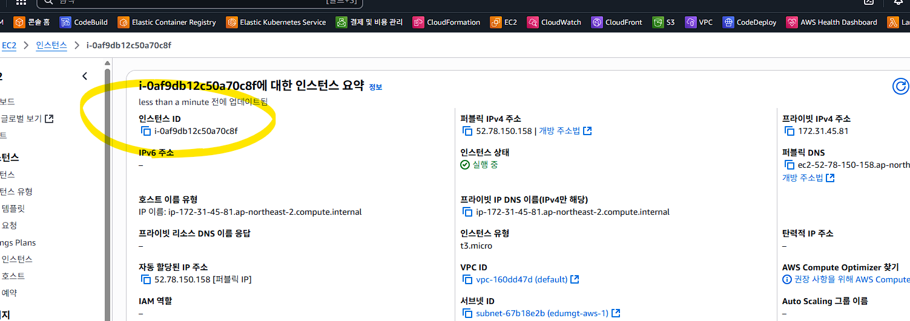
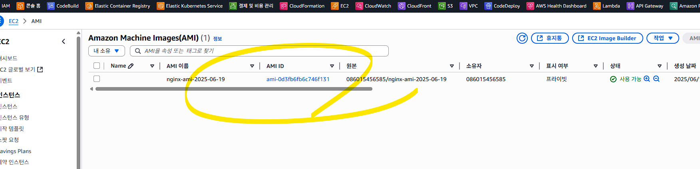
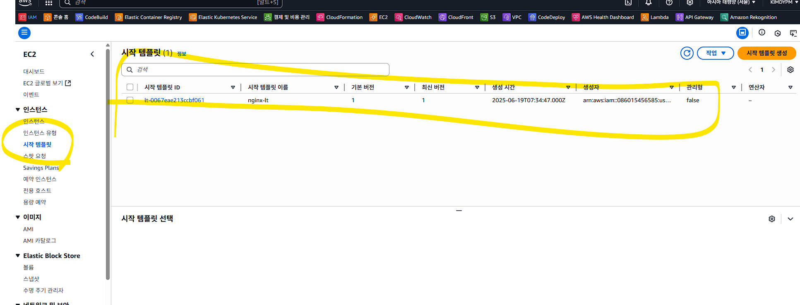
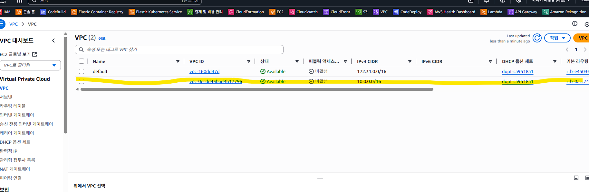
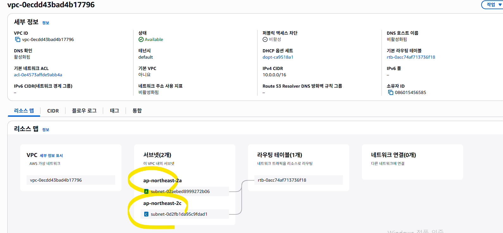
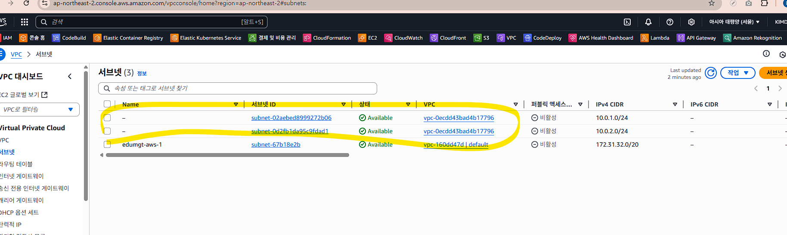
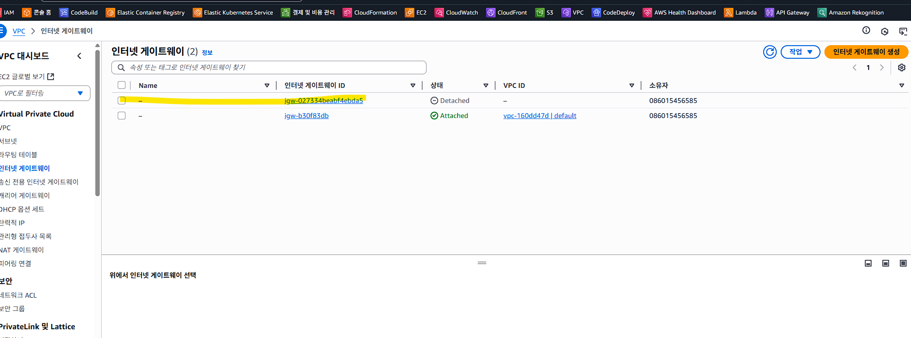
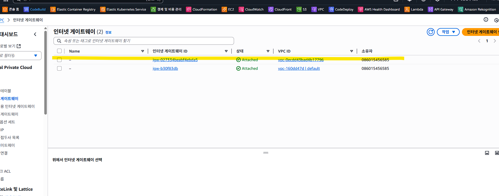

# AWS EC2 Auto - CLI 기반 구성 기록

## 개요
- AMI 생성부터 Launch Template, VPC/서브넷 구성까지 CLI 중심으로 정리했습니다.
- 콘솔 캡처와 함께 주요 흐름을 단계별로 확인할 수 있습니다.
- 보안상 민감할 수 있는 리소스 ID/계정 정보는 마스킹 처리했습니다.

## AMI 생성
## 생성 대상 Instance ID - AMI ID 가 아닙니다. 

aws ec2 create-image `
  --instance-id i-xxxxxxxx `
  --name "nginx-ami-2025-06-19" `
  --no-reboot

## {
##    "ImageId": "ami-xxxxxxxx"
## }

## 런치 템플릿 작성
## json "" 문제로 오류가 있어서 json 을 별도로 만듬

aws ec2 create-launch-template `
  --launch-template-name nginx-lt `
  --launch-template-data file://launch-template.json

## 이상 없으면
{
    "LaunchTemplate": {
    "LaunchTemplate": {
        "LaunchTemplateId": "lt-xxxxxxxx",
        "LaunchTemplateName": "nginx-lt",
        "CreateTime": "2025-06-19T07:34:47+00:00",
        "CreatedBy": "arn:aws:iam::<ACCOUNT_ID>:user/DevUser0002",
        "DefaultVersionNumber": 1,
        "LatestVersionNumber": 1,
        "Operator": {
            "Managed": false
        }
    }
}

## 콘솔에서 템플릿 확인

## ALB 시나리오
ALB (80포트)
  ↓
Target Group (헬스 체크 포함)
  ↓
Auto Scaling Group (최소 1 / 최대 5)
  ↓
Launch Template (AMI 기반 nginx 인스턴스)

## 여러개의 VM 이 생성됨으로 가상의 네트웍 구성 즉, VPC 작업
## aws ec2 create-vpc --cidr-block 10.0.0.0/16
{
    "Vpc": {
        "OwnerId": "<ACCOUNT_ID>",
        "InstanceTenancy": "default",
        "Ipv6CidrBlockAssociationSet": [],
        "CidrBlockAssociationSet": [
            {
                "AssociationId": "vpc-cidr-assoc-xxxxxxxx",
                "CidrBlock": "10.0.0.0/16",
                "CidrBlockState": {
                    "State": "associated"
                }
            }
        ],
        "IsDefault": false,
        "VpcId": "vpc-xxxxxxxx",
        "State": "pending",
        "CidrBlock": "10.0.0.0/16",
        "DhcpOptionsId": "dopt-xxxxxxxx"
    }
}

## 콘솔에서 확인

## 서브넷 구성
☑️ 서브넷이란?
VPC 내부의 IP 주소 범위를 쪼개놓은 네트워크 구획입니다.
EC2, ALB, RDS 등 모든 AWS 리소스는 서브넷에 속해 있어야만 생성 가능합니다.

📌 예시:
VPC: 10.0.0.0/16
  └─ Subnet A: 10.0.1.0/24  → EC2 실행 위치
  └─ Subnet B: 10.0.2.0/24  → ALB 실행 위치
즉, 서브넷이 없으면 EC2나 ALB 자체를 실행할 수 없습니다.

✅ 2. 왜 서브넷이 2개 이상 필요하냐? (특히 ALB와 ASG에서)
☑️ ALB는 기본적으로 고가용성(HA)을 요구합니다.
즉, 시스템이 고장나더라도 서비스가 계속 운영되도록 구성하는 것으로 가상 이지만, 실제 물리적으로
분리된 서비스 영역을 확보

ALB는 2개 이상의 가용 영역(AZ) 에 걸쳐 자동으로 인스턴스를 분산시켜야 하기 때문에,
서브넷을 최소 2개 이상(서로 다른 AZ에) 지정해야 합니다.

서브넷을 2개 이상 만들어서 AZ 분산 구성

✅ AZ (Availability Zone) 이란?
하나의 리전(Region) 안에 물리적으로 분리된 데이터 센터 묶음
예: 서울 리전(ap-northeast-2)에는 ap-northeast-2a, 2b, 2c 가 있음

ap-northeast-2a, 2b, 2c는 서울 리전(ap-northeast-2)에 속한 서로 다른 가용영역(AZ, Availability Zone)이며, 실제로는 물리적으로 분리된 IDC(데이터 센터)입니다.

## 서브넷 구성
aws ec2 create-subnet --vpc-id vpc-xxxxxxxx --cidr-block 10.0.1.0/24 --availability-zone ap-northeast-2a
aws ec2 create-subnet --vpc-id vpc-xxxxxxxx --cidr-block 10.0.2.0/24 --availability-zone ap-northeast-2c

## 구성확인

## 인터넷 게이트웨이 구성
aws ec2 create-internet-gateway
## 결과
{
    "InternetGateway": {
        "Attachments": [],
        "InternetGatewayId": "igw-xxxxxxxx",
        "OwnerId": "<ACCOUNT_ID>",
        "Tags": []
    }
}

## 아직 사용 전인 상태

## 게이트웨이를 VPC 에 매핑
aws ec2 attach-internet-gateway --internet-gateway-id igw-xxxxxxxx --vpc-id vpc-xxxxxxxx

## 매핑 상태

