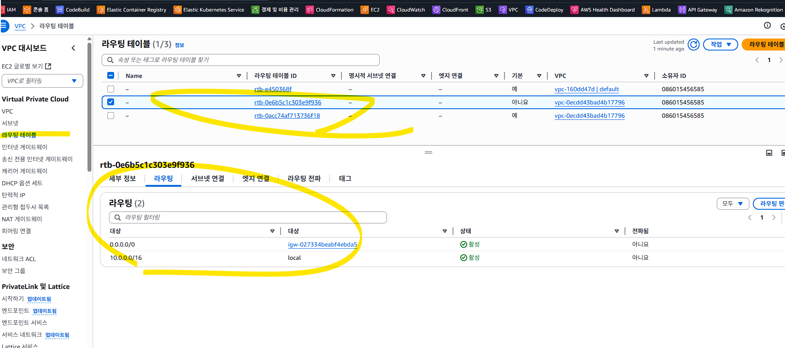
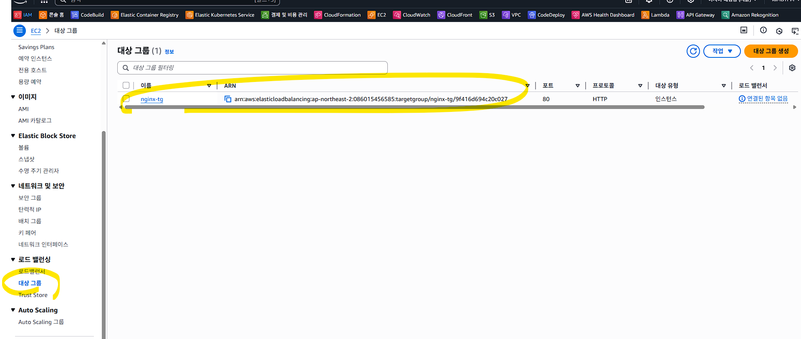
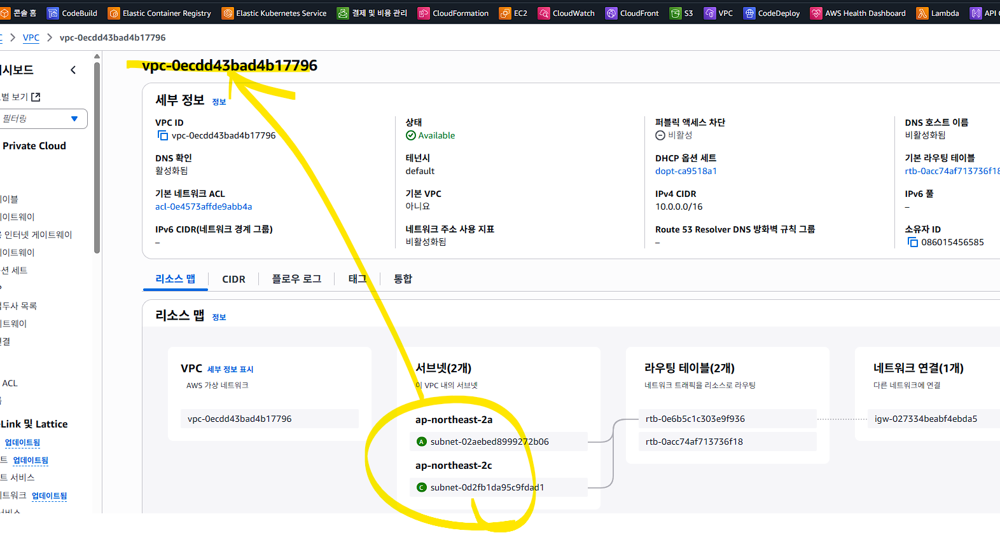
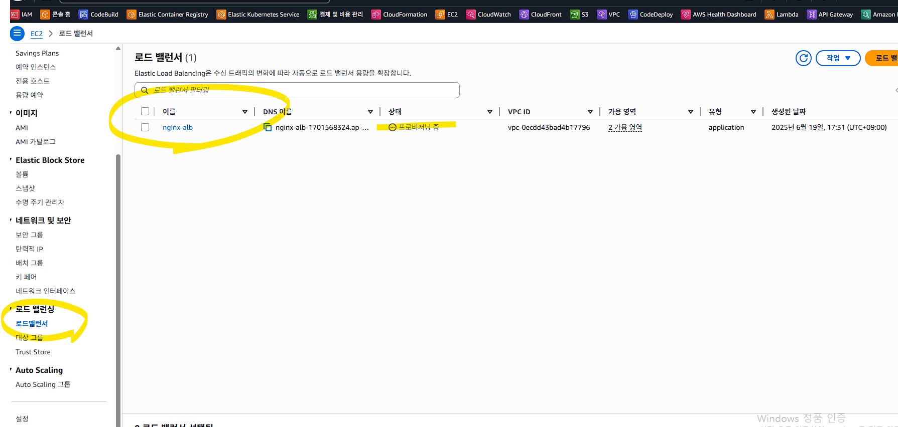
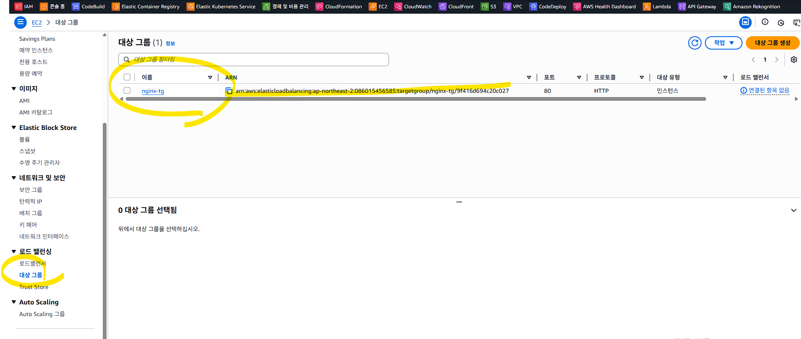
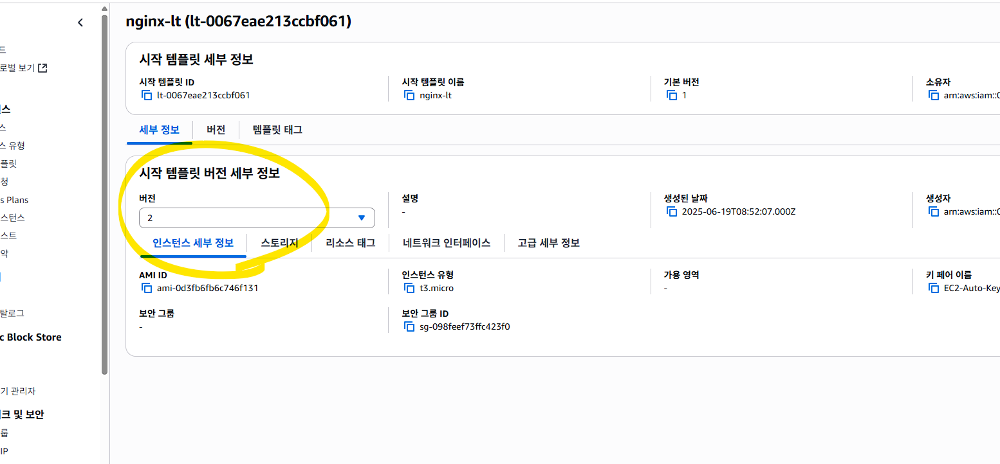
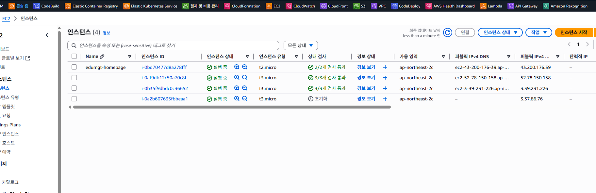
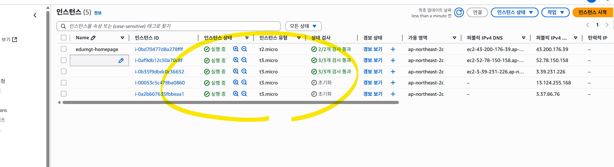
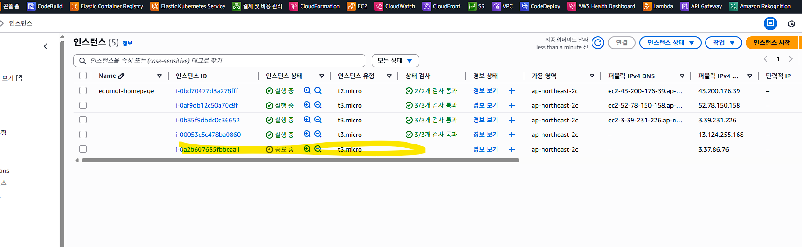
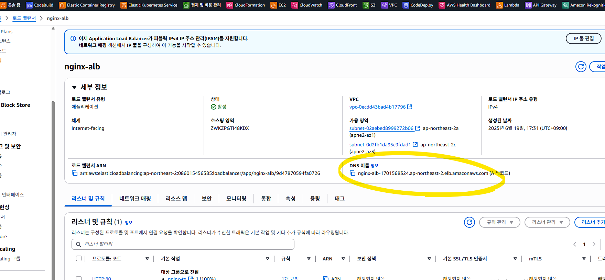

# AWS EC2 Auto - 라우팅/ALB/ASG 단계별 기록

## 개요
- 라우팅 테이블과 IGW 연결, Target Group/ALB/ASG 생성 흐름을 정리했습니다.
- 오류 상황과 해결 방법을 함께 기록해 문제 재현 시 참고할 수 있습니다.
- 보안상 민감할 수 있는 리소스 ID/계정 정보는 마스킹 처리했습니다.

## 라우팅 테이블 생성 및 인터넷 게이트웨이(IGW) 연결
"라우팅 테이블 생성 및 인터넷 게이트웨이(IGW) 연결은 왜 해야 하나요?"
→ 이건 AWS VPC에서 EC2나 ALB가 외부 인터넷과 통신할 수 있도록 만드는 핵심 조건입니다.

✅ 핵심 배경: AWS는 기본적으로 ‘인터넷 차단’ 상태
VPC, 서브넷, EC2를 만들었다고 해서 자동으로 인터넷에 연결되지 않습니다.

인터넷과 연결하려면 반드시 다음 조건을 만족해야 합니다:
| 항목                  | 역할                                    |
| ------------------- | ------------------------------------- |
| **인터넷 게이트웨이 (IGW)** | VPC를 외부 인터넷과 연결하는 관문                  |
| **라우팅 테이블**         | IGW로 향하는 트래픽 경로 지정                    |
| **서브넷과 라우팅 테이블 연결** | 해당 서브넷이 외부 트래픽을 IGW로 보낼 수 있도록 함       |
| **퍼블릭 IP**          | EC2가 외부에서 접근 가능하도록 (또는 NAT + 프라이빗 구성) |

✅ 비유로 설명하면?
[EC2 인스턴스] ← 서브넷 ← 라우팅 테이블 ← IGW ← 인터넷
EC2 인스턴스는 서브넷에 속해 있고,

서브넷은 라우팅 테이블을 따라 트래픽을 밖으로 보냅니다.

라우팅 테이블에 “0.0.0.0/0 → IGW” 라는 경로가 있어야만 외부로 나갈 수 있습니다.

## 작업
aws ec2 create-route-table --vpc-id vpc-xxxxxxxx

## 결과
{
    "RouteTable": {
        "Associations": [],
        "PropagatingVgws": [],
        "RouteTableId": "rtb-xxxxxxxx",
        "Routes": [
            {
                "DestinationCidrBlock": "10.0.0.0/16",
                "GatewayId": "local",
                "Origin": "CreateRouteTable",
                "State": "active"
            }
        ],
        "Tags": [],

## 작업
aws ec2 create-route --route-table-id rtb-xxxxxxxx --destination-cidr-block 0.0.0.0/0 --gateway-id igw-xxxxxxxx

## 콘솔에서 확인

## 서브넷 연결
aws ec2 associate-route-table --subnet-id subnet-xxxxxxxx --route-table-id rtb-xxxxxxxx
aws ec2 associate-route-table --subnet-id subnet-xxxxxxxx --route-table-id rtb-xxxxxxxx

## 결과
{
    "AssociationId": "rtbassoc-xxxxxxxx",
    "AssociationState": {
        "State": "associated"
    }
}

## 서브넷을 퍼블릭으로 설정
aws ec2 modify-subnet-attribute --subnet-id subnet-xxxxxxxx --map-public-ip-on-launch
aws ec2 modify-subnet-attribute --subnet-id subnet-xxxxxxxx --map-public-ip-on-launch

## ALB , Target Group
aws elbv2 create-target-group `
  --name nginx-tg `
  --protocol HTTP `
  --port 80 `
  --vpc-id vpc-xxxxxxxx `
  --target-type instance `
  --health-check-path /index.html

## 결과
{
    "TargetGroups": [
        {
            "TargetGroupArn": "arn:aws:elasticloadbalancing:ap-northeast-2:<ACCOUNT_ID>:targetgroup/nginx-tg/9f416d694c20c027",
            "TargetGroupName": "nginx-tg",
            "Protocol": "HTTP",
            "Port": 80,
            "VpcId": "vpc-xxxxxxxx",
            "HealthCheckProtocol": "HTTP",
            "HealthCheckPort": "traffic-port",
            "HealthCheckEnabled": true,
            "HealthCheckIntervalSeconds": 30,
            "HealthCheckTimeoutSeconds": 5,
            "HealthyThresholdCount": 5,
            "UnhealthyThresholdCount": 2,
            "HealthCheckPath": "/index.html",
            "Matcher": {
                "HttpCode": "200"

## Target Group 확인

## ALB 생성
aws elbv2 create-load-balancer `
  --name nginx-alb `
  --subnets subnet-xxxxxxxx subnet-xxxxxxxx `
  --security-groups sg-xxxxxxxx `
  --scheme internet-facing `
  --type application `
  --ip-address-type ipv4

## Error
An error occurred (InvalidConfigurationRequest) when calling the CreateLoadBalancer operation: One or more security groups are invalid

## Error 원인
PS C:\edumgt-java-education\AWS_EC2_AUTO> aws ec2 describe-security-groups --group-ids sg-xxxxxxxx --query 'SecurityGroups[*].VpcId'      
[
    "vpc-xxxxxxxx"
]

PS C:\edumgt-java-education\AWS_EC2_AUTO> aws ec2 describe-subnets --subnet-ids subnet-xxxxxxxx subnet-xxxxxxxx --query 'Subnets[*].VpcId'
[
    "vpc-xxxxxxxx",
    "vpc-xxxxxxxx"
]

## 위와 같은 경우
보안 그룹이 ALB와 같은 VPC에 속해 있는지 확인
ALB는 특정 VPC에 속해 있는 서브넷들을 기반으로 생성됩니다.
그런데 보안 그룹 sg-xxxxxxxx가 다른 VPC에 속해 있다면 무조건 오류 발생합니다.

## 서브넷 대상으로 SG 생성

aws ec2 create-security-group `
  --group-name nginx-alb-sg `
  --description "Allow HTTP for ALB" `
  --vpc-id vpc-xxxxxxxx

## 결과
{
    "GroupId": "sg-xxxxxxxx",
    "SecurityGroupArn": "arn:aws:ec2:ap-northeast-2:<ACCOUNT_ID>:security-group/sg-xxxxxxxx"
}

## 80 포트 개방
aws ec2 authorize-security-group-ingress `
  --group-id sg-xxxxxxxx `
  --protocol tcp `
  --port 80 `
  --cidr 0.0.0.0/0

## 결과
{
    "Return": true,
    "SecurityGroupRules": [
        {
            "SecurityGroupRuleId": "sgr-xxxxxxxx",
            "GroupId": "sg-xxxxxxxx",
            "GroupOwnerId": "<ACCOUNT_ID>",
            "IsEgress": false,
            "IpProtocol": "tcp",
            "FromPort": 80,
            "ToPort": 80,
            "CidrIpv4": "0.0.0.0/0",
            "SecurityGroupRuleArn": "arn:aws:ec2:ap-northeast-2:<ACCOUNT_ID>:security-group-rule/sgr-xxxxxxxx"
        }
    ]
}

## ALB 설치 다시
aws elbv2 create-load-balancer `
  --name nginx-alb `
  --subnets subnet-xxxxxxxx subnet-xxxxxxxx `
  --security-groups sg-xxxxxxxx `
  --scheme internet-facing `
  --type application `
  --ip-address-type ipv4

## 결과
{
    "LoadBalancers": [
        {
            "LoadBalancerArn": "arn:aws:elasticloadbalancing:ap-northeast-2:<ACCOUNT_ID>:loadbalancer/app/nginx-alb/9d47870594fa0726",    
            "DNSName": "nginx-alb-1701568324.ap-northeast-2.elb.amazonaws.com",
            "CanonicalHostedZoneId": "ZWKZPGTI48KDX",
            "CreatedTime": "2025-06-19T08:31:03.552000+00:00",
            "LoadBalancerName": "nginx-alb",
            "Scheme": "internet-facing",
            "VpcId": "vpc-xxxxxxxx",
            "State": {
                "Code": "provisioning"
            },
            "Type": "application",

## ALB 생성확인
ALB의 "프로비저닝 중 (provisioning)"
ALB가 생성 명령은 수락되었고,
이제 AWS 내부에서 리소스 생성 중,
즉, ALB가 정상적으로 작동할 수 있도록 백엔드에서 셋업 중이라는 뜻입니다.

## ALB에 리스너 연결 (Target Group 연결)
## 타겟그룹 다시 확인

## ARN 주의
load-balancer-arn : arn:aws:elasticloadbalancing:ap-northeast-2:<ACCOUNT_ID>:loadbalancer/app/nginx-alb/9d47870594fa0726
TargetGroupArn=arn:aws:elasticloadbalancing:ap-northeast-2:<ACCOUNT_ID>:targetgroup/nginx-tg/9f416d694c20c027

## 실행
aws elbv2 create-listener `
  --load-balancer-arn arn:aws:elasticloadbalancing:ap-northeast-2:<ACCOUNT_ID>:loadbalancer/app/nginx-alb/9d47870594fa0726 `
  --protocol HTTP `
  --port 80 `
  --default-actions Type=forward,TargetGroupArn=arn:aws:elasticloadbalancing:ap-northeast-2:<ACCOUNT_ID>:targetgroup/nginx-tg/9f416d694c20c027

## 결과
{
    "Listeners": [
        {
            "ListenerArn": "arn:aws:elasticloadbalancing:ap-northeast-2:<ACCOUNT_ID>:listener/app/nginx-alb/9d47870594fa0726/2fb676f38719a11e",
            "LoadBalancerArn": "arn:aws:elasticloadbalancing:ap-northeast-2:<ACCOUNT_ID>:loadbalancer/app/nginx-alb/9d47870594fa0726",    
            "Port": 80,
            "Protocol": "HTTP",
            "DefaultActions": [
                {
                    "Type": "forward",
                    "TargetGroupArn": "arn:aws:elasticloadbalancing:ap-northeast-2:<ACCOUNT_ID>:targetgroup/nginx-tg/9f416d694c20c027",   
                    "ForwardConfig": {
                        "TargetGroups": [
                            {
                                "TargetGroupArn": "arn:aws:elasticloadbalancing:ap-northeast-2:<ACCOUNT_ID>:targetgroup/nginx-tg/9f416d694c20c027",

## AutoScaling Group
aws autoscaling create-auto-scaling-group `
  --auto-scaling-group-name nginx-asg `
  --launch-template "LaunchTemplateName=nginx-lt,Version=1" `
  --min-size 1 `
  --max-size 3 `
  --desired-capacity 1 `
  --vpc-zone-identifier "subnet-xxxxxxxx,subnet-xxxxxxxx" `
  --target-group-arns arn:aws:elasticloadbalancing:ap-northeast-2:<ACCOUNT_ID>:targetgroup/nginx-tg/9f416d694c20c027

## Error
An error occurred (ValidationError) when calling the CreateAutoScalingGroup operation: One or more security groups in the launch template are not linked to the VPCs configured in the Auto Scaling group

launch template 의 보안그룹이 지금 만드는 VPC 의 보안그룹과 다름.
launch template 은 변경 불가 하니, 삭제 후 재 생성필요

이전에 만든 template.json 을 다시 구성
{
  "ImageId": "ami-xxxxxxxx",
  "InstanceType": "t3.micro",
  "SecurityGroupIds": ["sg-xxxxxxxx"],
  "KeyName": "EC2-Auto-Key"
}

위에서 
07a03565 ----> 098feef73ffc423f0 으로 변경

## 템플릿 버젼 다르게 적용
## 최초 생성 명령
aws ec2 create-launch-template `
  --launch-template-name nginx-lt `
  --launch-template-data file://template.json

## 재적용 명령 - ver 2 생성
aws ec2 create-launch-template-version `
  --launch-template-name nginx-lt `
  --source-version 1 `
  --launch-template-data file://template.json

  ## 결과
  {
    "LaunchTemplateVersion": {
        "LaunchTemplateId": "lt-xxxxxxxx",
        "LaunchTemplateName": "nginx-lt",
        "VersionNumber": 2,
        "CreateTime": "2025-06-19T08:52:07+00:00",
        "CreatedBy": "arn:aws:iam::<ACCOUNT_ID>:user/DevUser0002",
        "DefaultVersion": false,
        "LaunchTemplateData": {
            "ImageId": "ami-xxxxxxxx",
            "InstanceType": "t3.micro",
            "KeyName": "EC2-Auto-Key",
            "SecurityGroupIds": [
                "sg-xxxxxxxx"
            ]
        },
        "Operator": {
            "Managed": false
        }
    }
}

## 버젼 2 생성확인

## 오류 난 템플릿 연결 명령 수정 후 재실행
aws autoscaling create-auto-scaling-group `
  --auto-scaling-group-name nginx-asg `
  --launch-template "LaunchTemplateName=nginx-lt,Version=2" `
  --min-size 1 `
  --max-size 3 `
  --desired-capacity 1 `
  --vpc-zone-identifier "subnet-xxxxxxxx,subnet-xxxxxxxx" `
  --target-group-arns arn:aws:elasticloadbalancing:ap-northeast-2:<ACCOUNT_ID>:targetgroup/nginx-tg/9f416d694c20c027

## 현재 인스탄스 목록 확인

## 인스탄스 리프레시
aws autoscaling start-instance-refresh `
  --auto-scaling-group-name nginx-asg `
  --preferences '{\"MinHealthyPercentage\":100,\"InstanceWarmup\":60}'

## 결과
{
    "InstanceRefreshId": "9d008452-4306-4db7-b31e-2b637eb85b89"
}

## 목록 재 확인

## 재생성 확인 명령
aws autoscaling describe-instance-refreshes `
  --auto-scaling-group-name nginx-asg `
  --query 'InstanceRefreshes[*].{Status:Status,StartTime:StartTime}'
## 결과
[
    {
        "Status": "InProgress",
        "StartTime": "2025-06-19T09:03:24+00:00"
    }
]

## 운영상태 확인
aws elbv2 describe-target-health `
  --target-group-arn arn:aws:elasticloadbalancing:ap-northeast-2:<ACCOUNT_ID>:targetgroup/nginx-tg/9f416d694c20c027 `
  --region ap-northeast-2 `
  --query 'TargetHealthDescriptions[*].{Instance:Target.Id,Status:TargetHealth.State}' `
  --output table
## 서버 이상

## 이상 없으면 다음 주소 접속 가능

