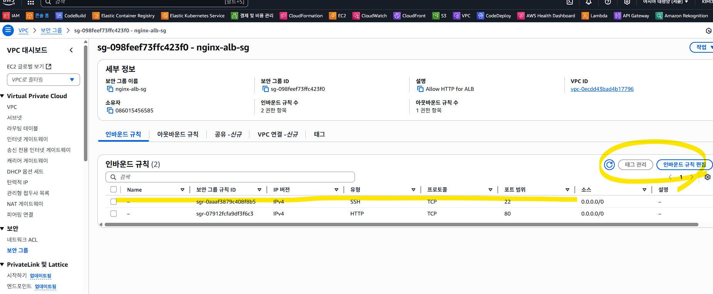
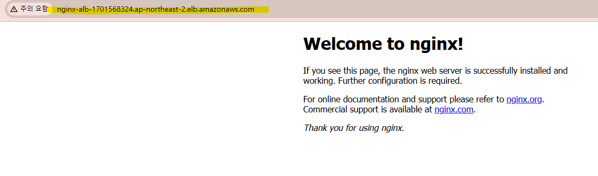
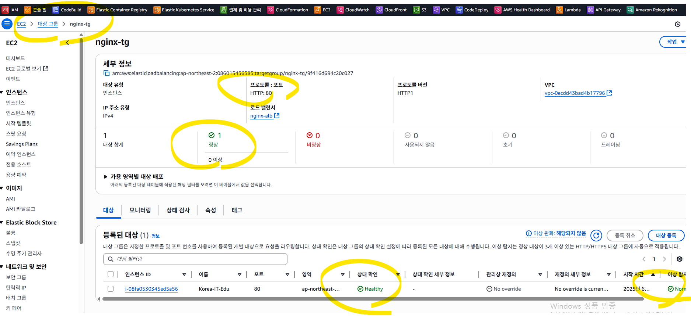

# AWS EC2 Auto - 운영 점검 및 스트레스 테스트

## 개요
- SSH 접속/보안그룹 점검과 Nginx 재설치 과정을 캡처와 함께 정리했습니다.
- 스트레스 테스트용 Launch Template 생성 예시를 포함했습니다.
- 보안상 민감할 수 있는 IP/키 이름/리소스 ID는 마스킹 처리했습니다.

## SSH 접속 및 보안 그룹 점검
```bash
ssh -i "<KEY_NAME>.pem" root@<PUBLIC_IP>
```
서버 접속이 되지 않을 경우 보안 그룹 인바운드 규칙을 먼저 확인합니다.


## 포트/서비스 점검 및 Nginx 재설치
```bash
lsof -i :80
apt install net-tools
netstat -tulnp | grep ':80'
apt update
apt install nginx -y
systemctl start nginx
```
80 리스너가 없을 때 Nginx 재설치를 진행했습니다.


## 재설치 후 ALB 주소 접속 확인


## Target Group healthy 확인


## 스트레스 테스트용 Launch Template 생성
```bash
aws ec2 create-launch-template \
  --launch-template-name stress-test-template \
  --version-description "v1" \
  --launch-template-data '{
    "ImageId": "ami-xxxxxxxx",  
    "InstanceType": "t2.micro",
    "KeyName": "<KEY_NAME>",
    "SecurityGroupIds": ["sg-xxxxxxxx"],
    "UserData": "'"$(base64 -w 0 <<EOF
#!/bin/bash
stress --cpu 2 --timeout 600
EOF
)"'"
  }'
```
