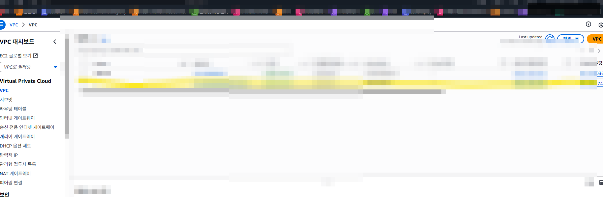
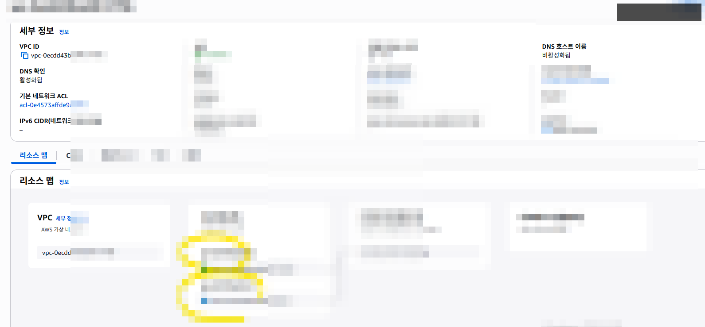
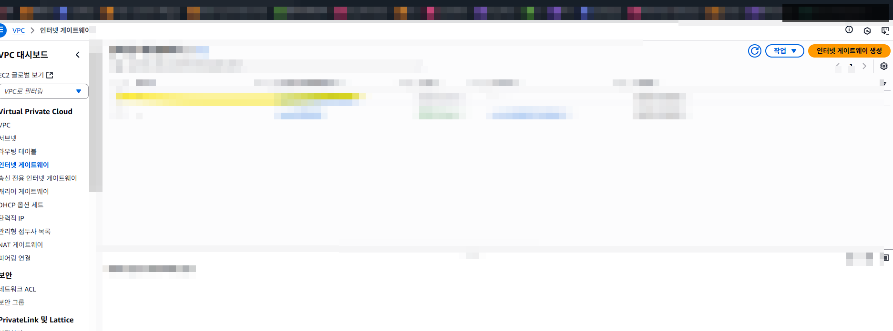
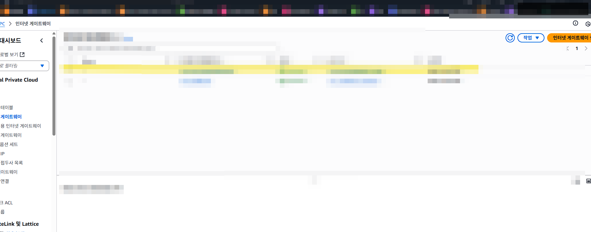

# EC2 실습 01 - 네트워크 기반 구성 (CLI)

## 목표
- EC2/ALB 배포에 필요한 기본 네트워크를 CLI로 구성합니다.
- VPC, Subnet, IGW, Route Table 연결 관계를 확인합니다.

## 아키텍처
- VPC: `10.0.0.0/16`
- Public Subnet A: `10.0.1.0/24` (AZ-a)
- Public Subnet C: `10.0.2.0/24` (AZ-c)
- IGW 연결 + 기본 라우트(`0.0.0.0/0`) 설정

## 1) VPC 생성
```bash
aws ec2 create-vpc --cidr-block 10.0.0.0/16
```

## 2) Subnet 2개 생성
```bash
aws ec2 create-subnet \
  --vpc-id vpc-0f8521283bac7fa3d \
  --cidr-block 10.0.1.0/24 \
  --availability-zone ap-northeast-2a

aws ec2 create-subnet \
  --vpc-id vpc-0f8521283bac7fa3d \
  --cidr-block 10.0.2.0/24 \
  --availability-zone ap-northeast-2c
```

## 3) IGW 생성 및 VPC 연결
```bash
aws ec2 create-internet-gateway
aws ec2 attach-internet-gateway \
  --internet-gateway-id igw-xxxxxxxx \
  --vpc-id vpc-xxxxxxxx
```

## 4) 라우팅 테이블 생성 및 기본 라우트 추가
```bash
aws ec2 create-route-table --vpc-id vpc-xxxxxxxx
aws ec2 create-route \
  --route-table-id rtb-xxxxxxxx \
  --destination-cidr-block 0.0.0.0/0 \
  --gateway-id igw-xxxxxxxx
```

## 5) 서브넷 연결 + 퍼블릭 IP 자동할당
```bash
aws ec2 associate-route-table \
  --subnet-id subnet-xxxxxxxx \
  --route-table-id rtb-xxxxxxxx

aws ec2 associate-route-table \
  --subnet-id subnet-yyyyyyyy \
  --route-table-id rtb-xxxxxxxx

aws ec2 modify-subnet-attribute \
  --subnet-id subnet-xxxxxxxx \
  --map-public-ip-on-launch

aws ec2 modify-subnet-attribute \
  --subnet-id subnet-yyyyyyyy \
  --map-public-ip-on-launch
```

## 검증 명령
```bash
aws ec2 describe-route-tables --route-table-ids rtb-xxxxxxxx
aws ec2 describe-subnets --subnet-ids subnet-xxxxxxxx subnet-yyyyyyyy
```

## 참고 이미지




