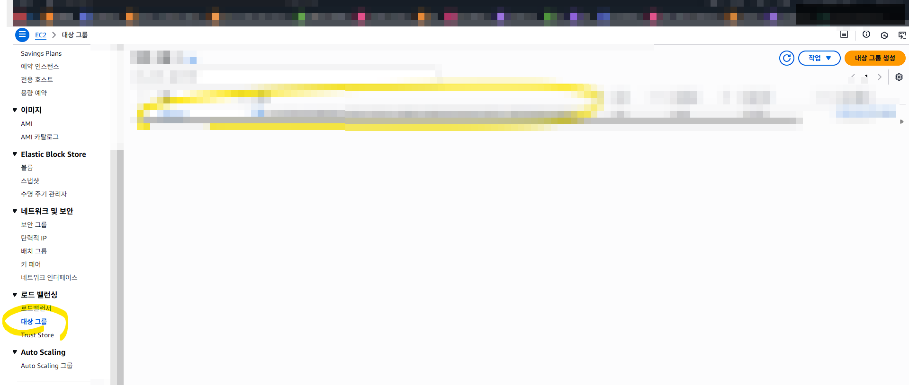
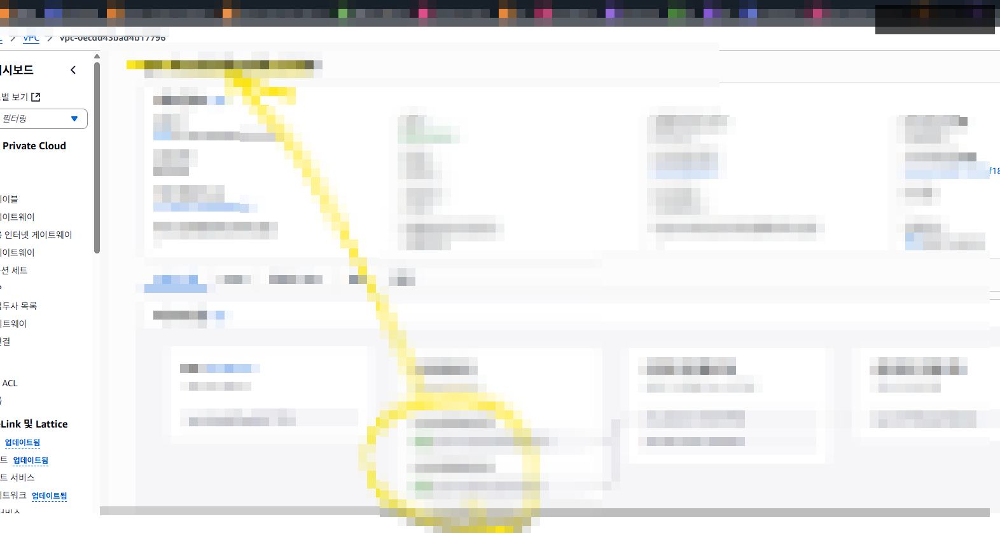
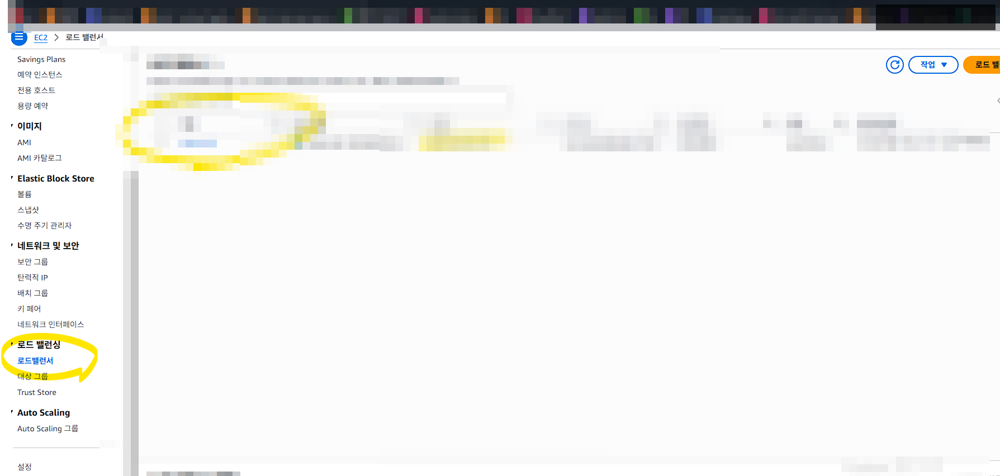
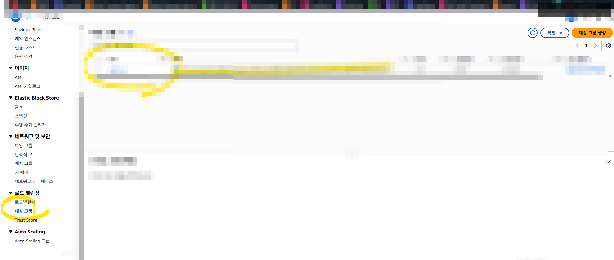

# EC2 실습 02 - ALB/Target Group 구성 (CLI)

## 목표
- Target Group, ALB, Listener를 구성해 트래픽을 인스턴스로 전달합니다.
- 보안그룹/VPC 불일치 오류를 재현하고 해결합니다.

## 1) ALB용 보안그룹 생성
```bash
aws ec2 create-security-group \
  --group-name nginx-alb-sg \
  --description "Allow HTTP for ALB" \
  --vpc-id vpc-xxxxxxxx

aws ec2 authorize-security-group-ingress \
  --group-id sg-xxxxxxxx \
  --protocol tcp \
  --port 80 \
  --cidr 0.0.0.0/0
```

## 2) Target Group 생성
```bash
aws elbv2 create-target-group \
  --name nginx-tg \
  --protocol HTTP \
  --port 80 \
  --vpc-id vpc-xxxxxxxx \
  --target-type instance \
  --health-check-path /index.html
```

## 3) ALB 생성
```bash
aws elbv2 create-load-balancer \
  --name nginx-alb \
  --subnets subnet-xxxxxxxx subnet-yyyyyyyy \
  --security-groups sg-xxxxxxxx \
  --scheme internet-facing \
  --type application \
  --ip-address-type ipv4
```

## 4) Listener 생성
```bash
aws elbv2 create-listener \
  --load-balancer-arn arn:aws:elasticloadbalancing:ap-northeast-2:<ACCOUNT_ID>:loadbalancer/app/nginx-alb/xxxxxxxx \
  --protocol HTTP \
  --port 80 \
  --default-actions Type=forward,TargetGroupArn=arn:aws:elasticloadbalancing:ap-northeast-2:<ACCOUNT_ID>:targetgroup/nginx-tg/xxxxxxxx
```

## 장애 포인트
- `InvalidConfigurationRequest`: 보안그룹이 다른 VPC에 속해 있는 경우 발생
- 해결 순서:
1. Subnet VPC 확인
2. SG VPC 확인
3. 동일 VPC로 SG 재생성

## 검증
```bash
aws elbv2 describe-load-balancers --names nginx-alb
aws elbv2 describe-target-groups --names nginx-tg
aws elbv2 describe-listeners --load-balancer-arn <ALB_ARN>
```

## 참고 이미지




