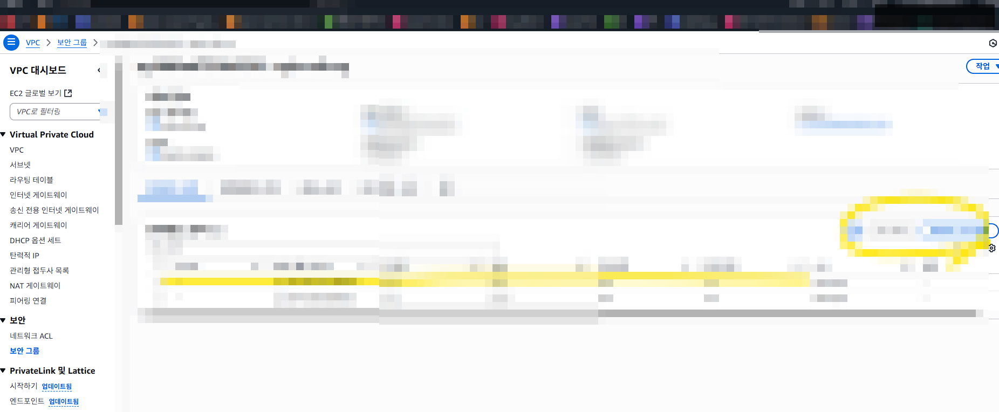

# EC2 실습 03 - ASG 운용 점검과 부하 테스트

## 목표
- Launch Template 기반으로 ASG를 운용하고, 상태 점검 루틴을 익힙니다.
- SSH 접속 이슈, 서비스 비정상 상태를 빠르게 복구합니다.

## 1) 인스턴스 접속 점검
```bash
ssh -i "<KEY_NAME>.pem" ubuntu@<PUBLIC_IP>
```

접속 불가 시 확인:
1. SG 인바운드 22 허용
2. 퍼블릭 IP/라우팅/IGW
3. 키 파일 권한 (`chmod 400`)

## 2) 웹 서비스 점검
```bash
sudo lsof -i :80
sudo netstat -tulnp | grep ':80'
sudo apt update
sudo apt install nginx -y
sudo systemctl enable --now nginx
```

## 3) ASG 상태 점검
```bash
aws autoscaling describe-auto-scaling-groups --auto-scaling-group-names <ASG_NAME>
aws elbv2 describe-target-health --target-group-arn <TG_ARN>
```

## 4) 부하 테스트용 Launch Template 예시
```bash
aws ec2 create-launch-template \
  --launch-template-name stress-test-template \
  --version-description "v1" \
  --launch-template-data '{
    "ImageId": "ami-xxxxxxxx",
    "InstanceType": "t3.micro",
    "KeyName": "<KEY_NAME>",
    "SecurityGroupIds": ["sg-xxxxxxxx"]
  }'
```

## 참고 이미지



