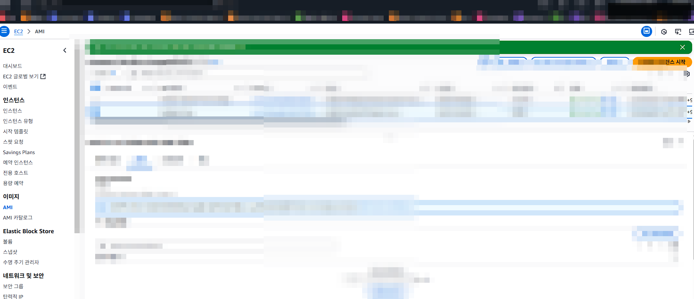
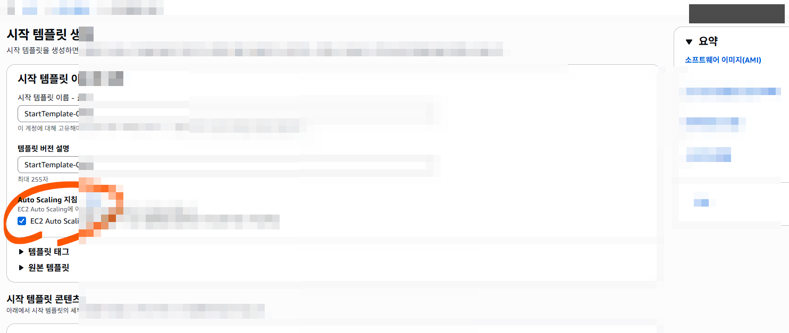
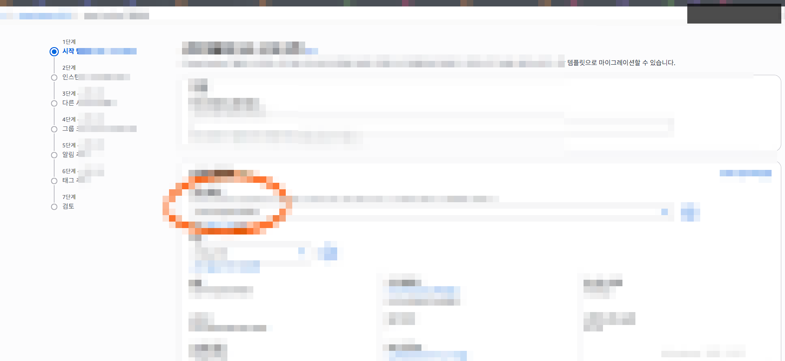
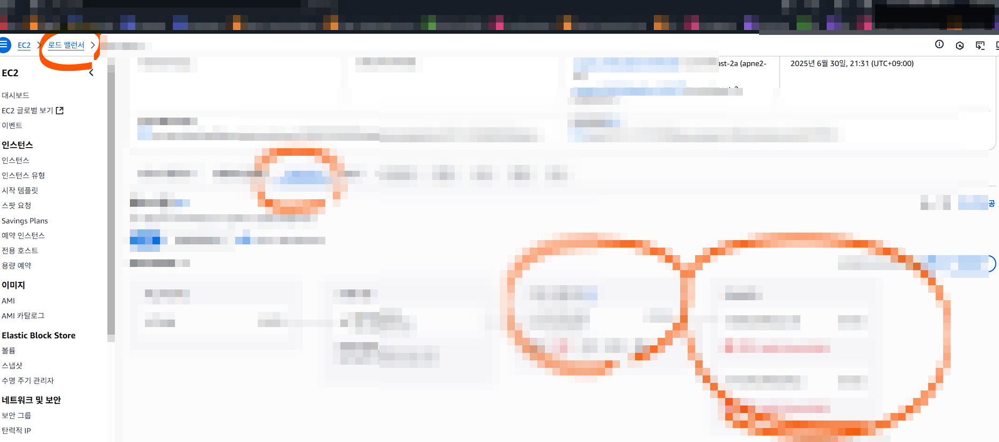

# EC2 실습 04 - 콘솔 기반 AMI/Template/ASG 체크리스트

CLI를 이미 수행한 상태에서 콘솔 화면으로 흐름을 복습할 때 사용하는 체크리스트입니다.

## 목표
- AMI 공유/권한, 시작 템플릿, 오토스케일링, 로드밸런서 연결 과정을 콘솔에서 점검
- 설정 누락 시 자주 발생하는 경고 메시지를 이해

## 체크리스트
1. AMI 권한
- 퍼블릭/프라이빗 공유 정책 확인
- 필요한 계정/조직만 접근하도록 제한

2. Launch Template
- AMI ID/인스턴스 타입/보안그룹/VPC 일관성 점검
- Template Version 이력 관리

3. Auto Scaling Group
- 최소/희망/최대 용량 값 점검
- 헬스체크 유형(EC2/ELB) 확인

4. Load Balancer 연결
- 2개 이상 가용영역(Subnet) 연결 여부
- Target Group/Listener 기본 라우팅 확인

5. 네트워크
- Public Subnet 라우팅 테이블에 `0.0.0.0/0 -> igw-...` 존재
- SG 인바운드: ALB(80/443), EC2(필요 최소 범위)

## 실습에서 자주 본 오류
- 보안그룹 VPC 불일치
- Subnet 가용영역 부족
- AMI와 인스턴스 타입(아키텍처) 미호환

## 참고 이미지 묶음
- AMI/권한: `image-88.png` ~ `image-97.png`
- VPC/Template: `image-98.png` ~ `image-113.png`
- ASG/LB 연동: `image-114.png` ~ `image-132.png`
- 점검/확장 정책: `image-133.png` ~ `image-157.png`

예시 화면:

