# AWS EC2 Auto - 0630 수업 정리

## 개요
- 콘솔 기반 Auto Scaling/ALB 구성 절차와 네트워크 설정을 단계별로 정리했습니다.
- CLI로 AMI/템플릿/ASG를 만드는 시나리오와 오류 대응 과정을 함께 포함했습니다.

## console 위주의 작업
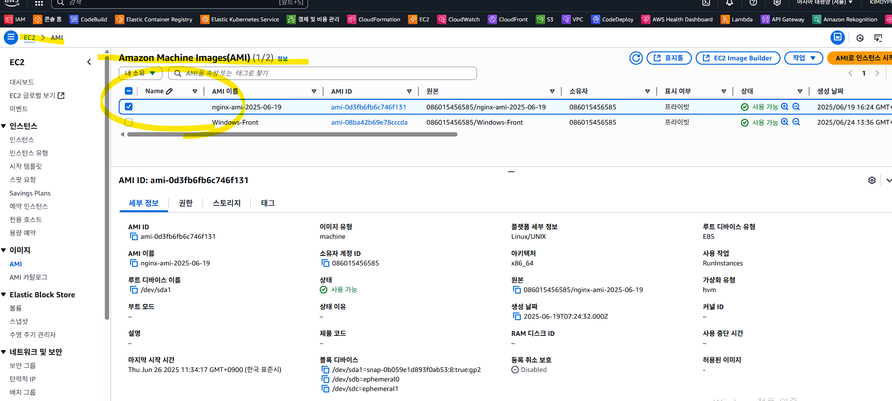
## AMI를 만들고, 확인 합니다.
## 좌측 메뉴의 시작 템플릿을 클릭합니다.
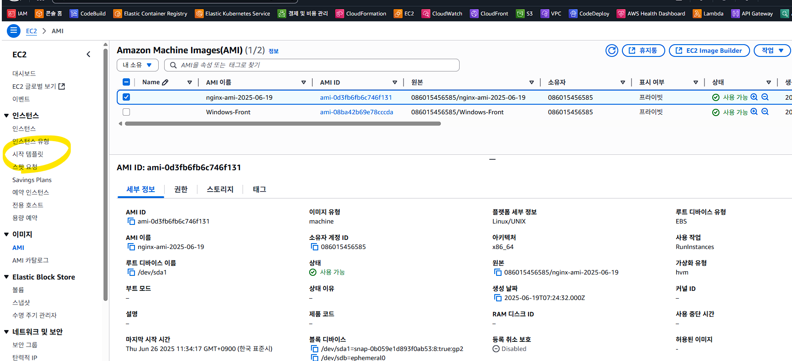 
## 우측 상단의 템플릿 생성 클릭합니다.
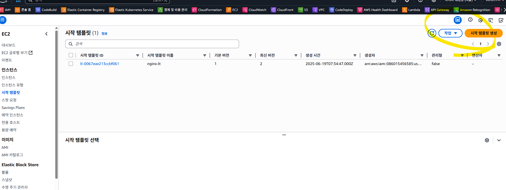
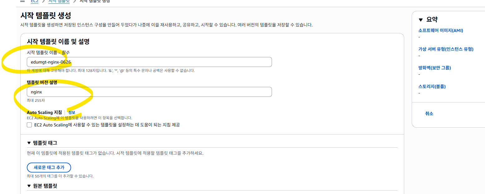
## 이름 및 설명을 입력 합니다.
## 중간 아래의 시작 템플릿 콘텐츠를 선택 합니다.
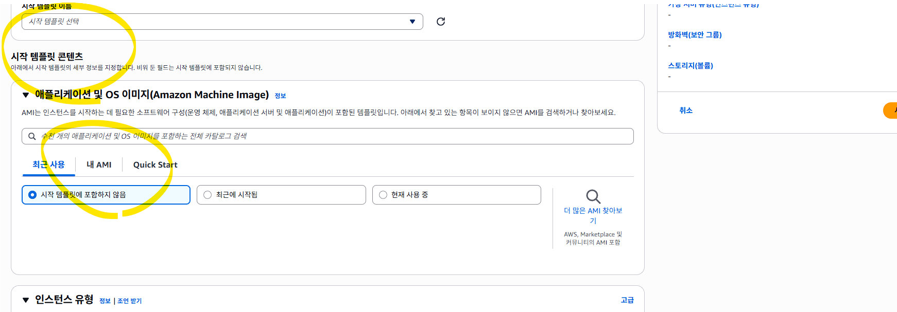
## 본인이 만든 AMI 선택
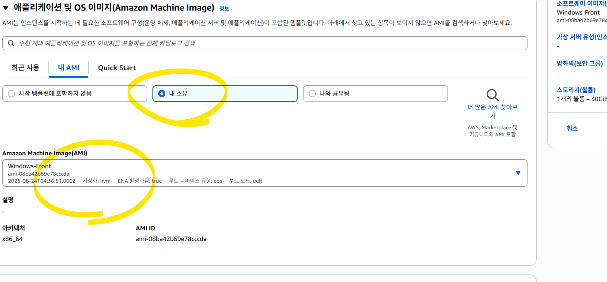
## 내 소유 또는 공유 - 공유는 지난번 수업에서 한것 처럼 공유된 이미지 입니다.
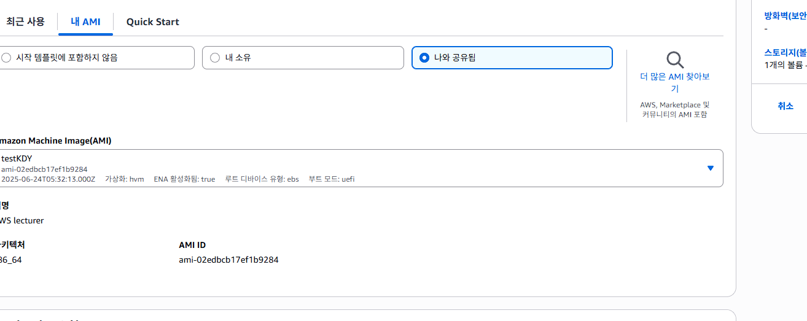

## 인스탄스 유형을 선택 합니다.
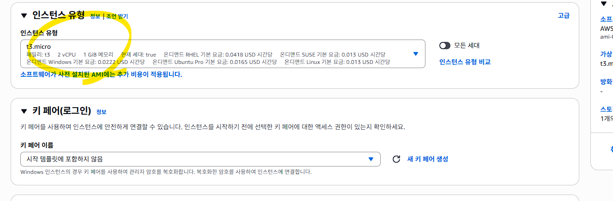

## EC2 생성과 유사한 작업으로 별도 키를 필요로 할때, 추가 생성 합니다.
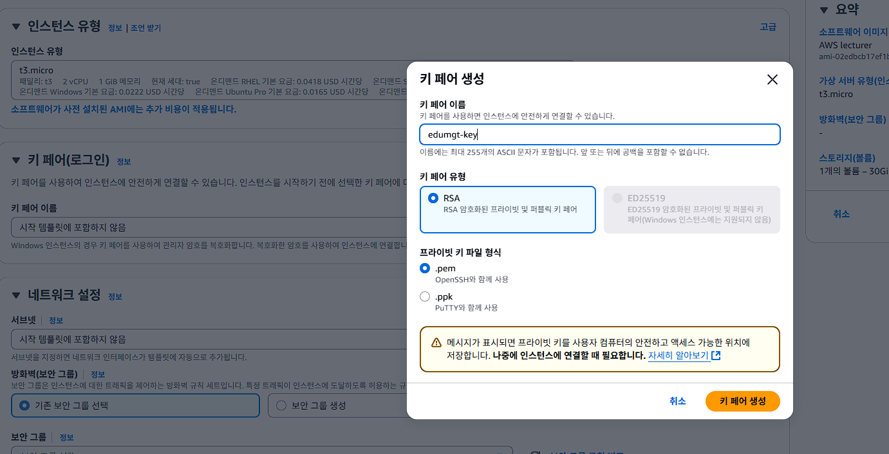

## 가상의 소속 희망 하는 서브넷 - 네트웍 구성 범위를 지정 합니다.
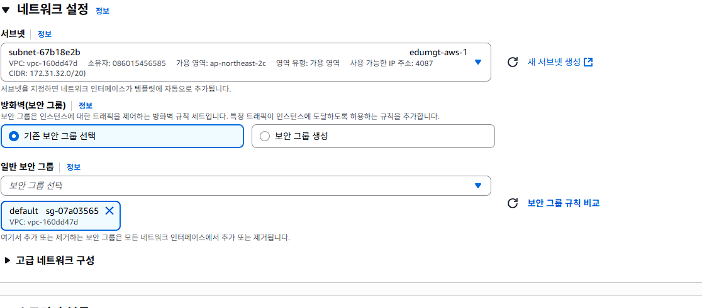
## 보안그룹 - 포트별 인/아웃바운드의 범위 목록의 그룹핑한 명칭을 새로 만들거나, 기존 그룹을 선택 합니다.
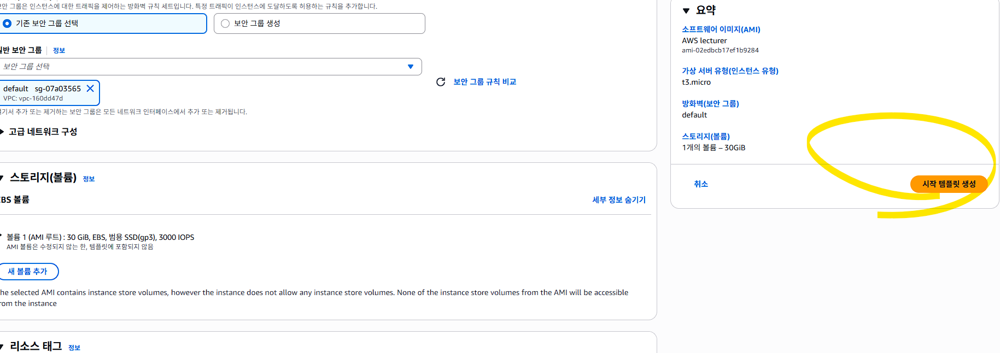
## 우측의 시작템플릿 생성 클릭 합니다.

## 템플릿 그룹 목록에서 확인 합니다.
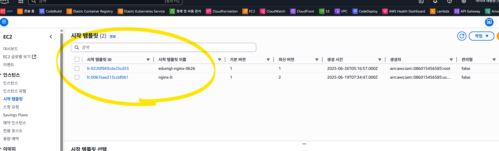

## 좌측의 AutoScaling 그룹을 선택 합니다.
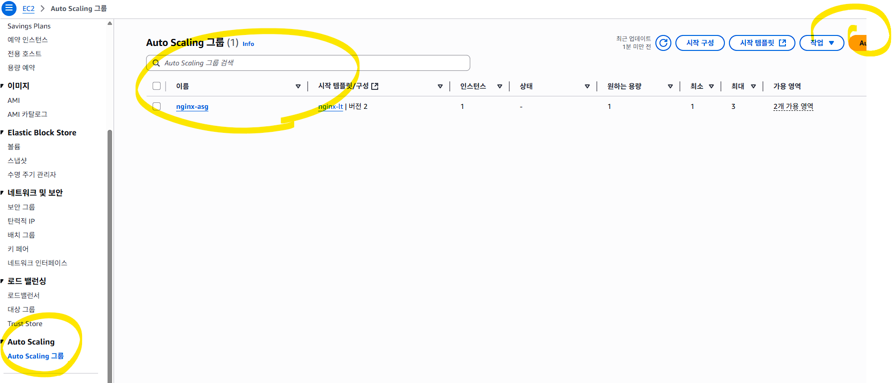

## 그룹 생성 1단계 화면 입니다.
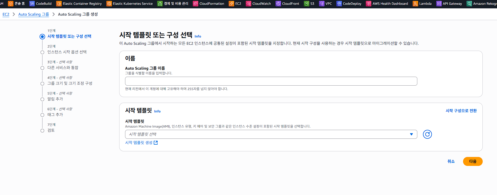

## 이름을 입력하고, 템플릿 목록에서 템플릿을 선택합니다. ( 위에서 만든 목록도 확인 )
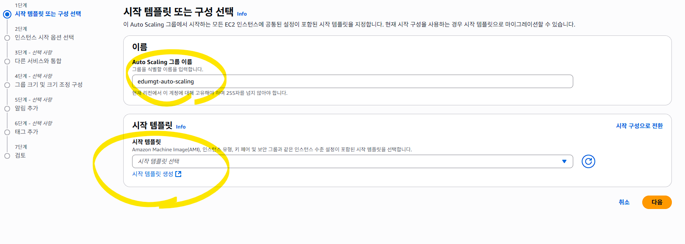

## 버젼, 보안그룹 등을 확인 합니다. AWS 에서는 템플릿 형태의 자동화 관련 스크립트는 버젼 관리를 제공 합니다.
## 수정, 삭제 등으로 꼬이는 것을 방지하기 위함.
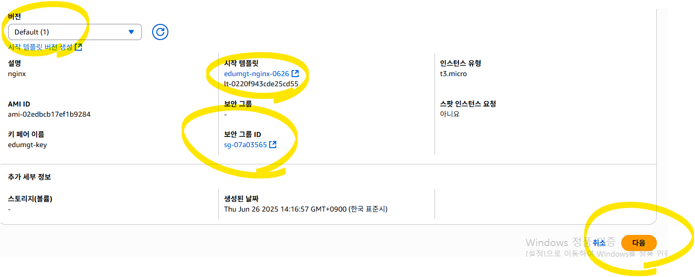

## 2단계의 화면으로 진행 됩니다.
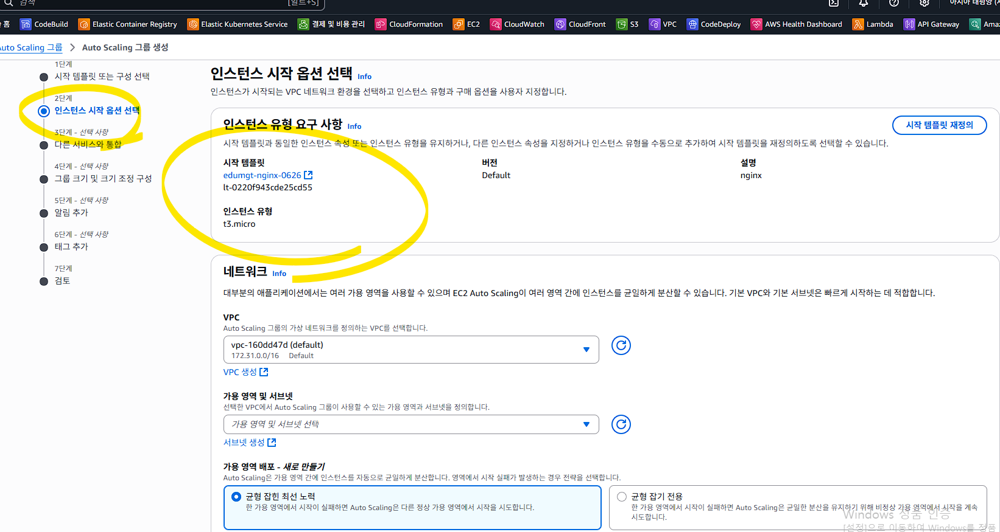

## VPC 영역에서 사용중인 서브넷 중 선택 가능 합니다. 다른 VPC 영역, 서브넷 등 가용영역 즉, 여러군데 분산하여
## 혹시라도 물리적인 문제 발생에 대비하는 취지 입니다.
## 가용영역에서 실패시 비가용영역을 이용할지, 가용영역에서 계속 재시도할지의 선택 입니다.
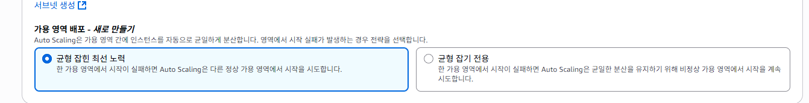

## 로드 밸런서와 연결 여부를 선택 합니다.
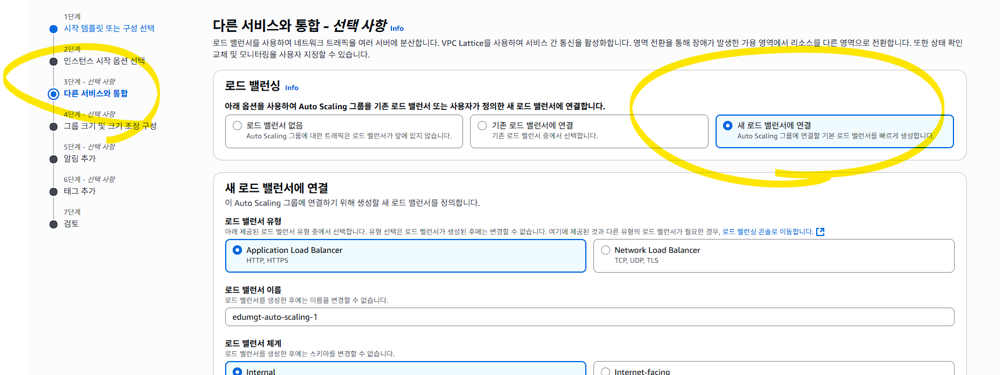

## 새로 만드는 로드밸런서가 http - 웹서버 운영에 맞는 선택으로 합니다.
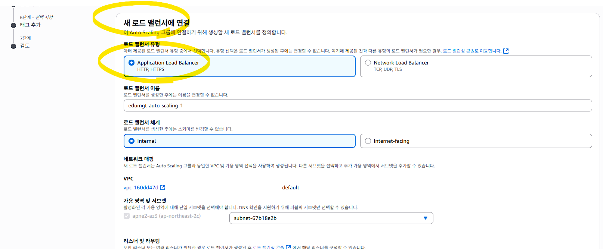

## internal - 내부에서만 접근의 의미
## Internal Load Balancer = 외부에서는 접근 불가
## 하지만 내부(같은 VPC, 피어링된 VPC, VPN 등)에서는 접근 가능
## 외부 접근이 필요하면 Internet-facing Load Balancer 사용
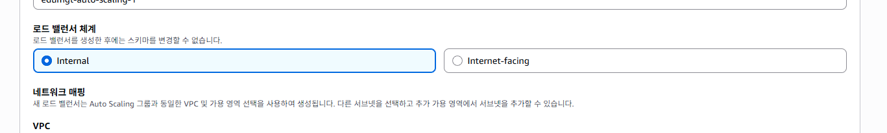

| 항목       | **Internal**       | **Internet-facing**           |
| -------- | ------------------ | ----------------------------- |
| IP 타입    | Private IP         | Public IP (Elastic IP 가능)     |
| 접근 대상    | VPC 내부에서만          | 전 세계 어디서든 인터넷을 통해 접근 가능       |
| 보안 그룹 필요 | 내부 접근만 허용          | 외부 인바운드 허용 필요 (예: 80/443)     |
| 주로 사용처   | 백엔드, 마이크로서비스, DB 등 | 웹 서버, REST API, 프론트엔드 서버      |
| 도메인 연결   | 내부 DNS만 가능         | 퍼블릭 도메인(예: example.com) 연결 가능 |

## 외부 가능 설정
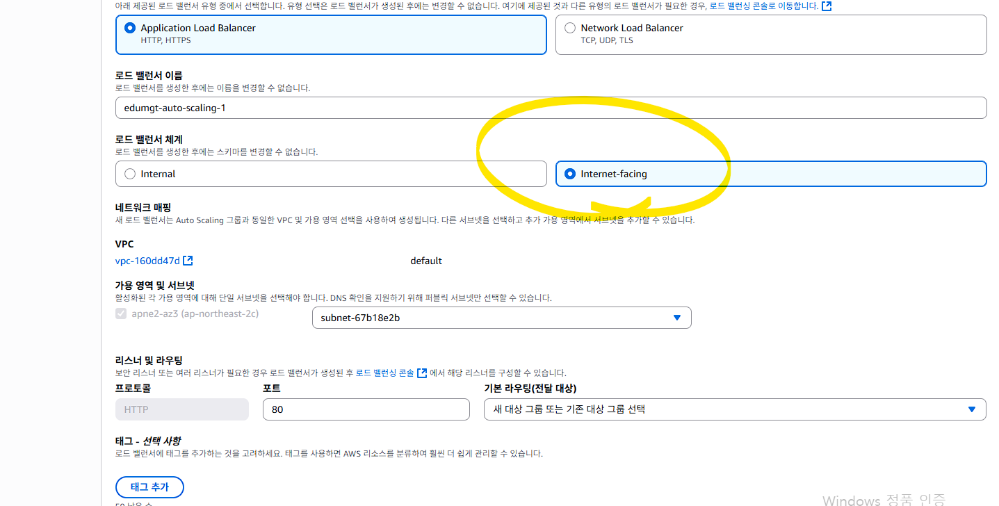

## 보안 주의사항 - 다른 조건들이 서로 맞아야 함
## Internet-facing LB를 쓴다고 무조건 열리는 건 아니고, 다음도 반드시 설정해야 합니다:
1. 보안 그룹 (인바운드: 80/443 허용)
2. 서브넷은 퍼블릭 서브넷이어야 함 (인터넷 게이트웨이 연결됨)
3. 라우팅 테이블에도 인터넷 게이트웨이 경로가 있어야 함

## 저장 중 다음과 같이 가용영역 1개, 라우팅 즉 **"기본 라우팅(Default Route)"**은 네트워크에서 목적지를 모를 때 데이터를 어디로 보낼지 정해놓은 경로입니다.
## 의 선택 오류 시 추가 필요
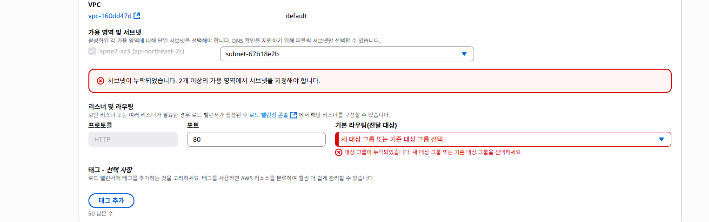

## 서브넷 추가를 위해 VPC 클릭
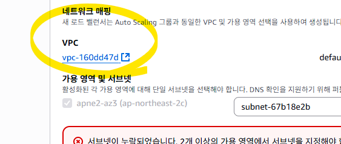 
## VPC 의 서브넷 몇개인지 확인 - 일반 단순 사용의 경우 무관함.
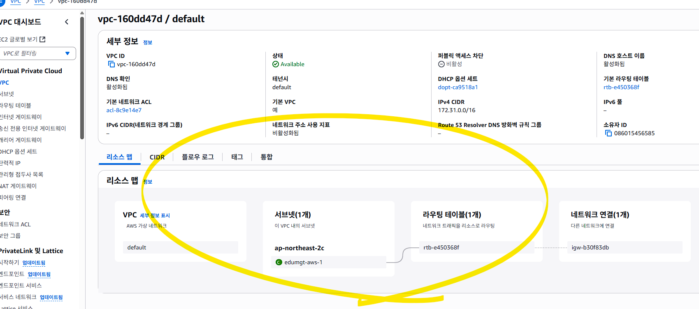
## 쉽게 말하면 아파트에 집(호수) 2개 사놓고 벽을 허물어 하나의 집으로 합친 것과 같음.
## 2개의 동에 각각 아파트 집(호수) 2개가 있는 경우도 유사

## 좌측 서브넷 클릭
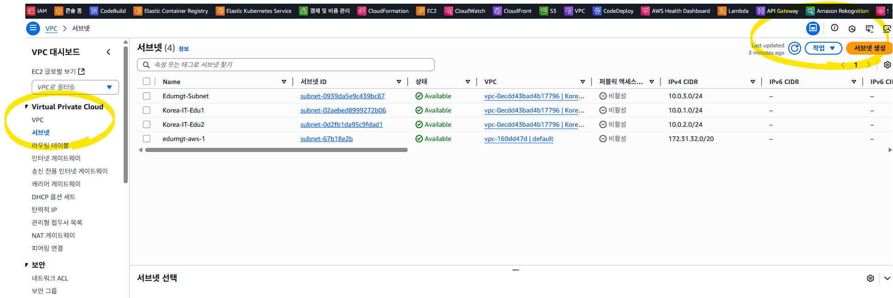

## 서브넷 생성을 위한 VPC 선택
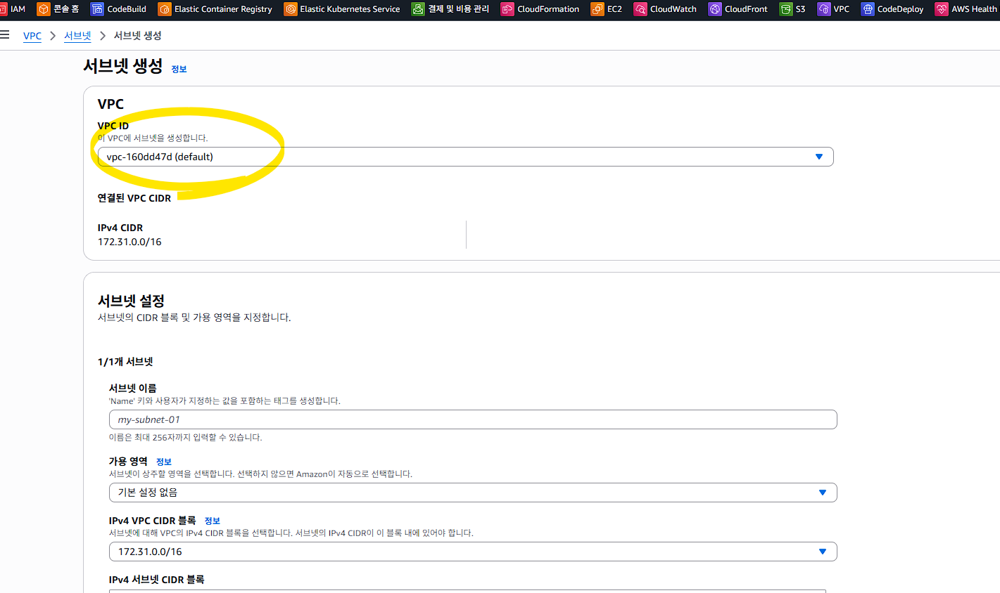
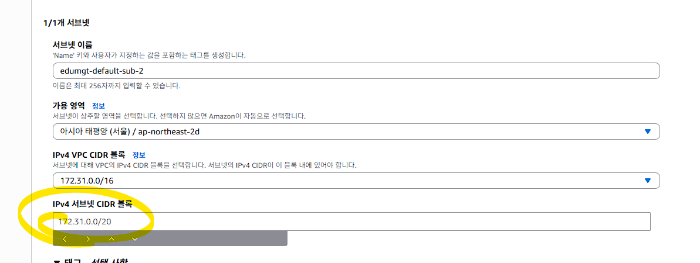

## 이름 및 가상의 IP 대역 선택
## CIDR
**IP CIDR (Classless Inter-Domain Routing)**은 IP 주소 범위를 표현하는 방식입니다.
간단히 말해: "IP주소/숫자" 형태로, 얼마나 많은 IP가 포함되어 있는지 나타냅니다.

✅ CIDR 표기법의 구조
<IP 주소>/<접두사 길이>
예: 192.168.0.0/24
192.168.0.0 → 시작 IP 주소

/24 → 앞의 24비트는 네트워크 주소, 나머지 비트는 호스트(IP)로 사용됨

✅ CIDR에서 /숫자는 무엇을 의미할까?
CIDR	네트워크 비트 수	호스트 수	IP 범위
/32	32비트 (고정 IP)	1개	1개 IP
/24	24비트	256개	예: 192.168.0.0 ~ 192.168.0.255
/16	16비트	65,536개	예: 192.168.0.0 ~ 192.168.255.255
/0	0비트 (기본 라우트)	전체 인터넷	모든 IP

🔍 예제
예1: 10.0.0.0/16
10.0.0.0부터 시작

앞 16비트는 네트워크 식별

나머지 16비트는 호스트 식별

총 약 65,536개 IP 포함 (10.0.0.0 ~ 10.0.255.255)

예2: 192.168.1.0/24
192.168.1.0 ~ 192.168.1.255

총 256개 IP (보통 254개 사용 가능: 1개는 네트워크 주소, 1개는 브로드캐스트 주소)

✅ 실무에서 CIDR은 어디서 쓰이나?
사용처	설명
VPC 생성	예: 10.0.0.0/16 → AWS VPC 주소 범위
서브넷 분할	10.0.1.0/24, 10.0.2.0/24 등
보안 그룹, ACL 설정	특정 IP 또는 범위 허용/차단 (203.0.113.55/32, 192.168.0.0/16)
라우팅 테이블	어떤 IP 범위는 어디로 라우팅할지 결정

✅ 요약
용어	설명
CIDR	IP 주소 + 서브넷 마스크를 간단하게 표기하는 방식 (192.168.0.0/24)
숫자 (/24 등)	네트워크 비트 수 (클수록 IP 개수 작음)
/0	모든 IP (기본 라우트)
/32	단일 IP (정확한 하나의 주소만 허용)

## 생성 클릭 시
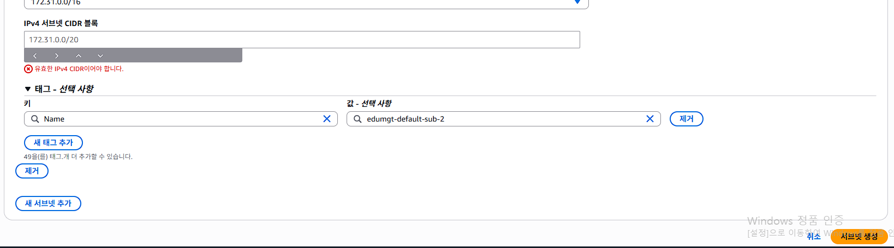
빨강색 으로 경고 보일 경우 - < > 의 클릭으로 조정 가능
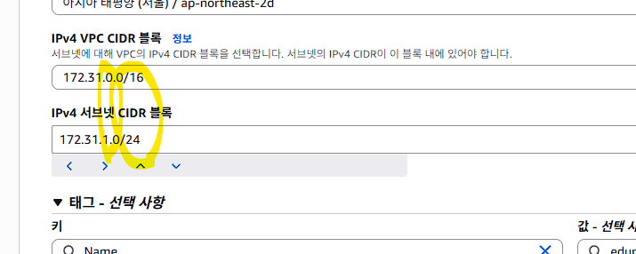
대역에서 IP 를 조정하여 지정 - 뒤의 숫자가 크도록 예를들어 16 이면 24로

## VPC 확인
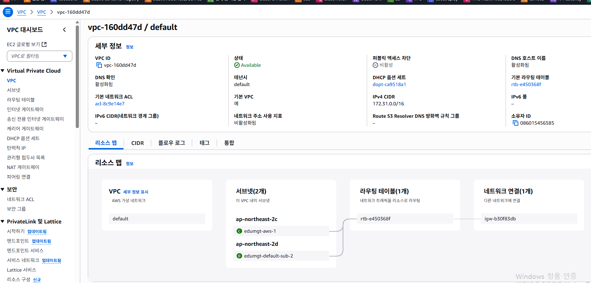
## 서브넷 2개

## 다시 LB 설정 화면으로 이동
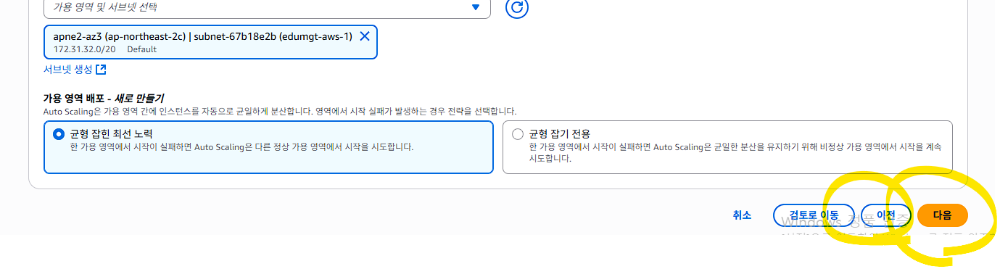
## 이전 버튼을 이용하면서 재 입력 
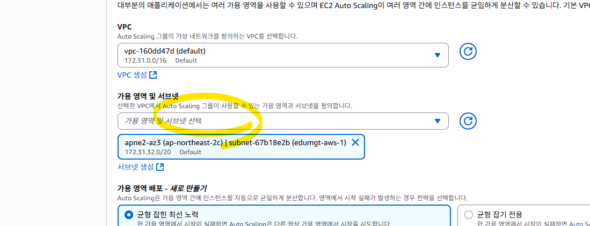
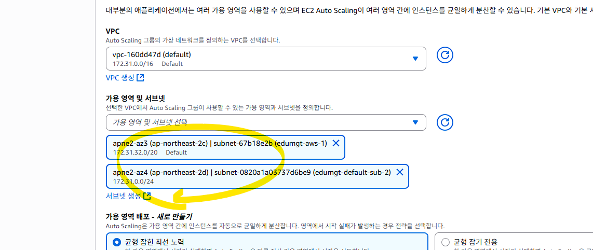

## 위와 같이 서브넷 2개 선택 확인 - 다음 클릭 - 이전 입력 상태로 새 Load Balancer 선택 유지
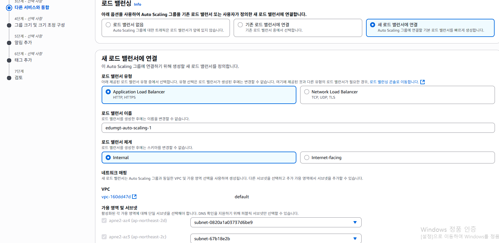
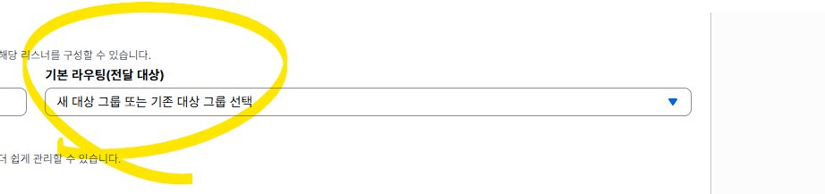
## 위의 기본 라우팅 생성
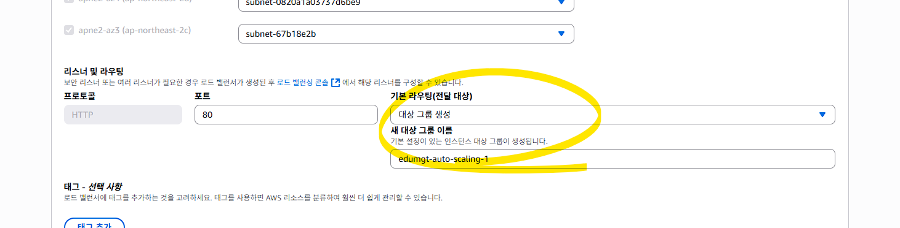

## 4단계로 넘어감
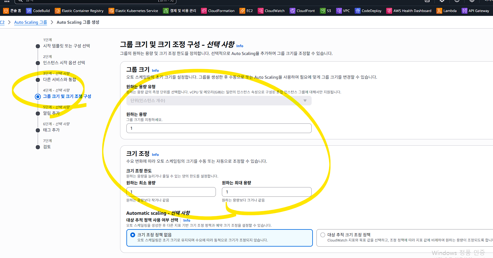
## 용량 설정
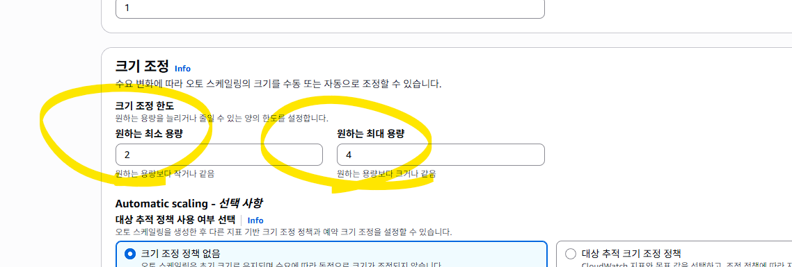

## 재기동 정책
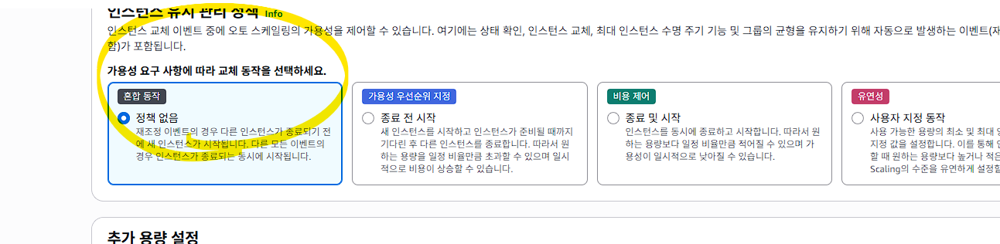
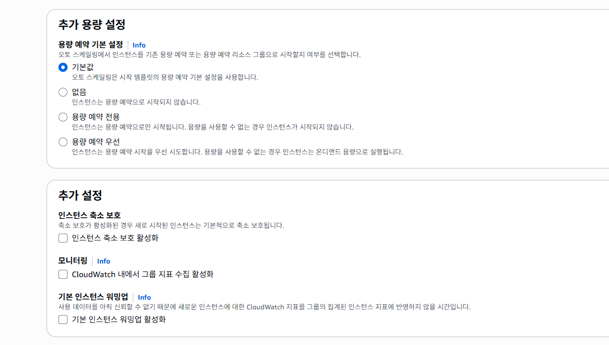

## 원하는 용량 보다 최소가 커야 함. 원하는 용량이 2이면 최소도 2 이상
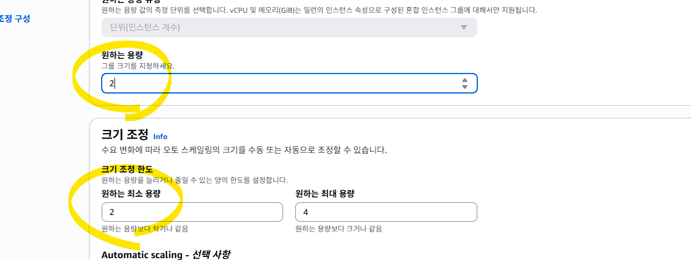

## 5단계 알림 추가 - SNS
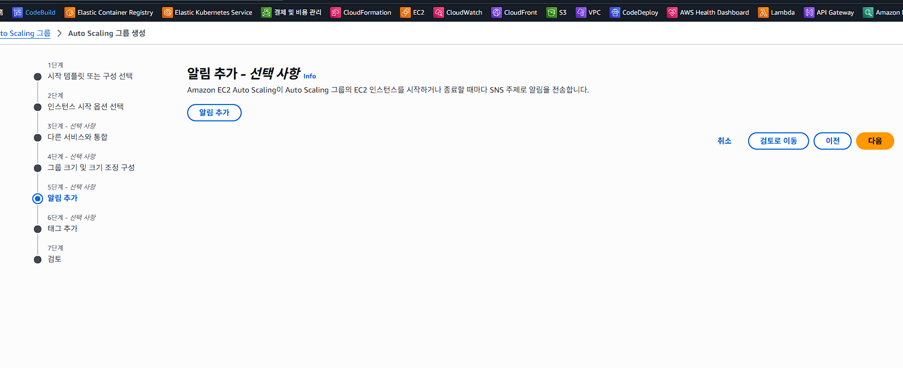
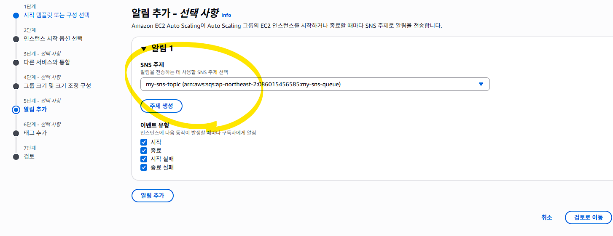
## SNS 없으면, 주제생성 가능
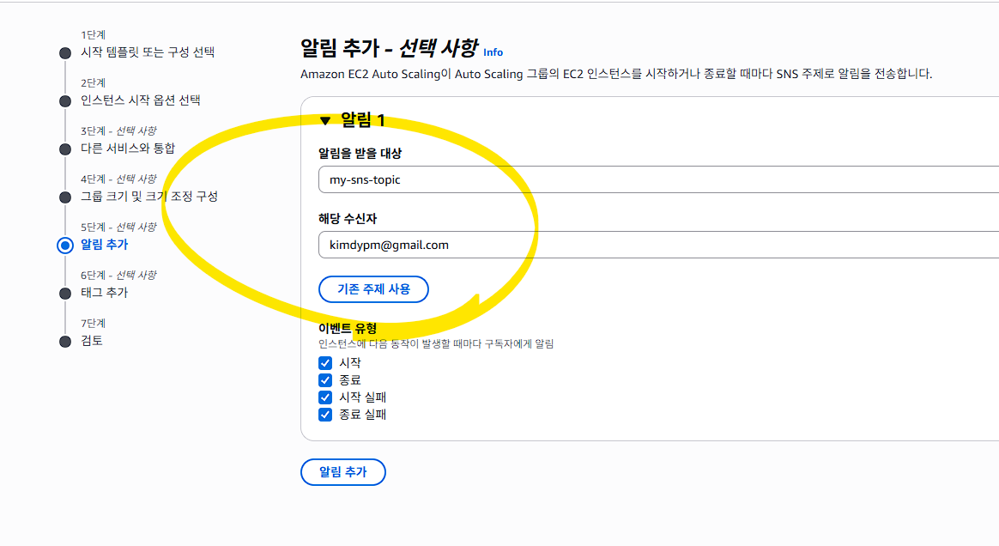
## 동일명 있는지 주의 필요

## 6단계 태그 정책
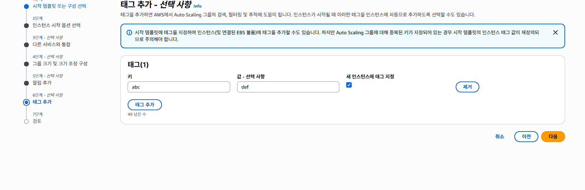

## 7단계는 검토 단계로 다시한번 전체내용 파악
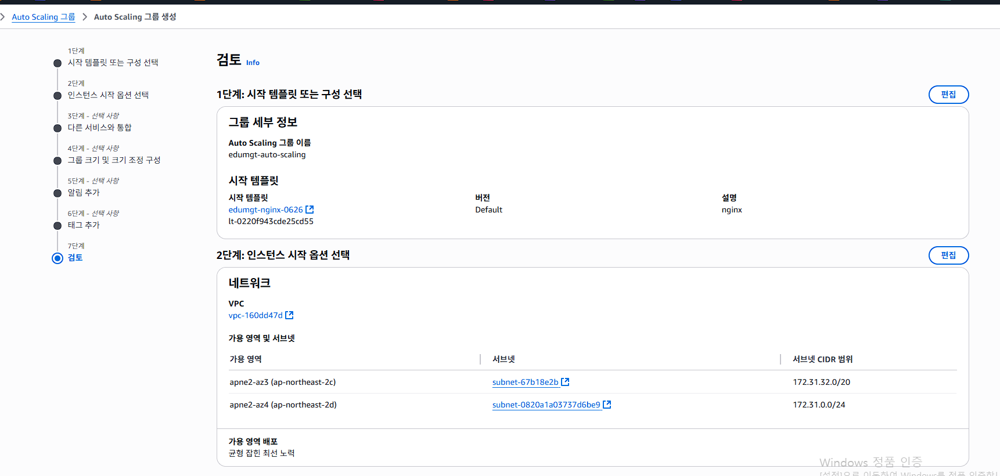

## 중간 이미지에서 사용자가 지정하는 정책 변경으로 이동
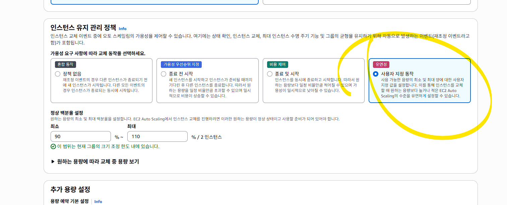

## 백분율을 임의 조정 - 실제 이런 설정은 없음
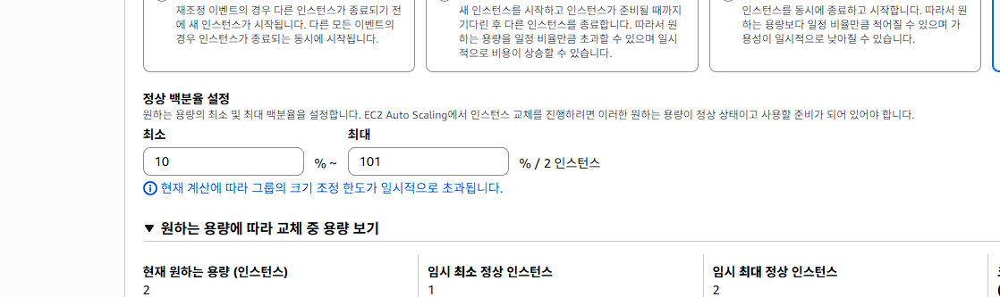

## 그룹 생성 중 목록 확인
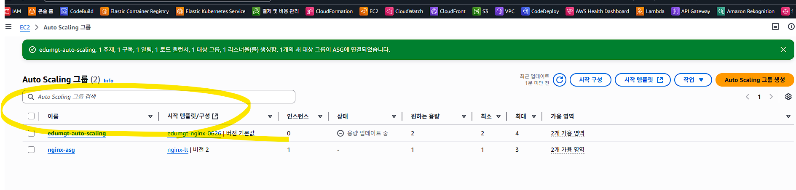

## 시작 템플릿 수정

## 템플릿 선택 후 작업 클릭


## 템플릿으로 시작


## 책의 stress 테스트 및 이미지와 같이 SNS noti 확인


## nginx-setup.sh 사전에 만듭니다.

## AWS CLI 사용
## aws configure get region
## 사용할 AMI ID 조회


## SSH 접속 Key 생성


## 보안그룹 ID


## 윈도우 PowerShell 사용 시 백틱 ` 으로 문장 연결 합니다.

## 시나리오
[1] EC2 하나 생성 후 nginx 설치 + index.html 배포
[2] 해당 EC2로 AMI 생성
[3] Launch Template + ASG + ALB 구성
[4] index.html 수정 시 → AMI 새로 생성
[5] Launch Template 새 버전 → ASG 점진적 롤링 업데이트

## EC2 1대 생성 + nginx 설치
# 1. EC2 생성
aws ec2 run-instances `
  --image-id ami-0c9c942bd7bf113a2 `
  --instance-type t3.micro `
  --key-name EC2-Auto-Key `
  --security-group-ids sg-07a03565 `
  --user-data file://nginx-setup.sh

## Error
An error occurred (UnauthorizedOperation) when calling the RunInstances operation: You are not authorized to perform this operation. User: arn:aws:iam::086015456585:user/DevUser0002 is not authorized to perform: ec2:RunInstances on resource: arn:aws:ec2:ap-northeast-2:086015456585:instance/* because no identity-based policy allows the ec2:RunInstances action. 

## 위의 에러 발생 시


## 권한 추가 중 10개 초과 문제가 다음일 경우도 있음


## AmazonEC2FullAccess 권한을 사용자 그룹에 주고, 사용자 그룹에 사용자를 속하도록 함
## 사용자 그룹 예시


## 사용자를 그룹에 포함시킴


## VM 생성 확인
{
    "ReservationId": "r-0f7e31d193251855a",
    "OwnerId": "086015456585",
    "Groups": [],
    "Instances": [
        {
            "Architecture": "x86_64",
            "BlockDeviceMappings": [],
            "ClientToken": "a4da16d0-2364-42f0-815a-9cabafa7f59a",
            "EbsOptimized": false,
            "EnaSupport": true,
            "Hypervisor": "xen",
            "NetworkInterfaces": [
                {
                    "Attachment": {
                        "AttachTime": "2025-06-19T07:17:48+00:00",
                        "AttachmentId": "eni-attach-00ad285364864a4e3",
                        "DeleteOnTermination": true,
                        "DeviceIndex": 0,
                        "Status": "attaching",
                        "NetworkCardIndex": 0
                    },
                    "Description": "",
                    "Groups": [
                        {
                            "GroupId": "sg-07a03565",
                            "GroupName": "default"
                        }
                    ],
                    "Ipv6Addresses": [],
                    "MacAddress": "0a:24:97:37:60:41",
                    "NetworkInterfaceId": "eni-0c969969db6f930f5",
                    "OwnerId": "086015456585",
                    "PrivateDnsName": "ip-172-31-47-28.ap-northeast-2.compute.internal",
                    "PrivateIpAddress": "172.31.47.28",

                    ... 이하 생략 ...
## VM 생성 확인

