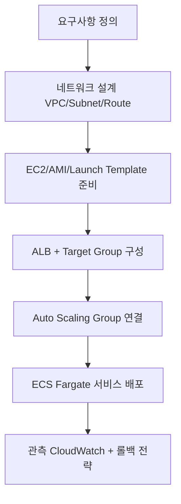
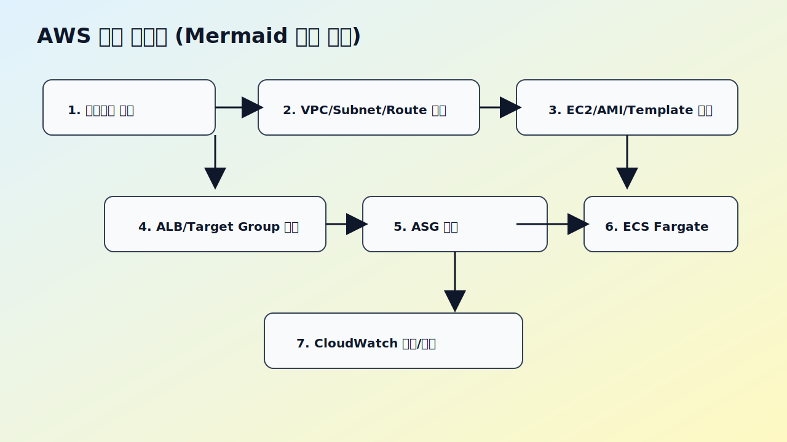
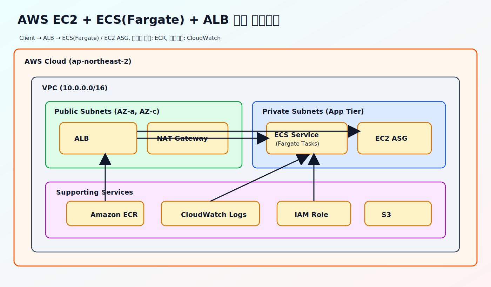

# AWS EC2/ECS/LB 실습 저장소

EC2 기반 인프라 구성부터 ECS Fargate 배포, ALB 설정까지 한 번에 학습할 수 있도록 정리한 저장소입니다.

## 학습 범위
- `EC2`: VPC, Subnet, IGW, Route Table, AMI, Launch Template, ASG 실습
- `ECS`: ECS/Fargate 핵심 개념 + 실습형 배포 가이드
- `LB`: ALB/NLB 개념과 설정 포인트, 트러블슈팅
- `BE-fastapi`: Docker 기반 FastAPI Hello World API 샘플
 
## 권장 학습 순서
1. `EC2/001.md` ~ `EC2/003.md` (네트워크 + ALB + ASG)
2. `LB/001_alb_settings_lab.md` (리스너/타겟 그룹/헬스체크)
3. `ECS/001_fargate_hands_on.md` (Fargate 실습)
4. `ECS/002_ecs_alb_lab.md` (ECS + ALB 라우팅)
5. `ECS/003_study_checklist.md` (스터디 질문/점검)

## Mermaid 순서도


### 순서도 이미지


## AWS 클라우드 아키텍처 다이어그램


## 빠른 실행: FastAPI Docker 샘플
```bash
cd BE-fastapi
docker build -t be-fastapi-hello .
docker run --rm -p 8000:8000 be-fastapi-hello
```

확인:
```bash
curl http://127.0.0.1:8000/
curl http://127.0.0.1:8000/health
```

## 문서 인덱스
- [EC2 학습 가이드](EC2/README.md)
- [ECS 학습 가이드](ECS/README.md)
- [LB 학습 가이드](LB/README.md)
- [FastAPI Docker 샘플](BE-fastapi/README.md)
- [AWS CLI 배포 샘플 3종](deploy/README.md)

## 빠른 트러블슈팅
- EC2 콘솔에서 `EC2 Instance Connect` 접속이 `Access denied`로 실패하면, `EC2/003.md`의 접속 점검 항목부터 확인합니다.
- 특히 `TCP 22` 인바운드 허용만으로는 부족할 수 있으며, 퍼블릭 IP, IGW 라우팅, IAM 권한, 지원 AMI 여부를 함께 확인해야 합니다.

## 보안 처리 안내
- `EC2` 폴더의 스크린샷 이미지는 민감정보 노출 방지를 위해 마스킹 처리했습니다.
- 문서 내 ID, 계정, IP, ARN 예시는 `xxxxxxxx` 형태로 표기했습니다.
